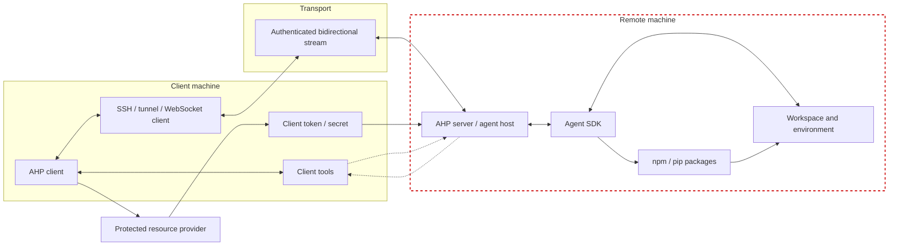

# Threat Model

This document captures the core security assumptions, risks, and minimum controls for Agent Host Protocol (AHP) implementations. AHP is a bidirectional JSON-RPC protocol that lets clients connect to an agent host, subscribe to session state, dispatch actions, access resources, create terminals, authenticate to protected resources, and optionally contribute client-side tools and customizations.

## Current safety status

The current protocol **is not safe by itself for untrusted remote use**. AHP defines the message shapes and state flows, but it does not itself establish peer identity, authorize capabilities, constrain token forwarding, sandbox resource access, sanitize rendered content, or make client-contributed tools safe to invoke. Implementations must add those controls before treating a remote host or client as safe.

## Goal: untrusted mode

The desired end state is an **untrusted mode**: AHP and client implementations should let a user connect to an agent host and still get useful work products without risking local compromise or long-lived secrets. In this mode, the client treats the host as hostile by default, disables or tightly scopes client tools, avoids silent token forwarding, and only shares explicit, bounded inputs.

This mode is still valuable. A user might only want the agent to produce artifacts such as a `PLAN.md`, or might give the host a short-lived, least-privilege token that can push a PR as an external, non-collaborator identity. The threat model below describes current implementation risks so the protocol and clients can work toward this goal while preserving a hard boundary around the user's local client, local files, credentials, and durable account authority.

## Security model

- **AHP messages are untrusted data, not authority.** A peer can spoof agent names, safety text, auth prompts, tool confirmations, URLs, terminal output, file diffs, and session state.
- **Transport identity is outside the wire protocol.** WebSocket, SSH, tunnel, MessagePort, or custom transports must authenticate peers before `initialize`. AHP `clientId` is not an identity unless it is bound to the authenticated transport.
- **Remote hosts are high-risk by default.** In SSH/tunnel/remote WebSocket scenarios, assume the remote agent host, agent SDK, model output, workspace, terminal environment, package installs, and all server messages may be compromised.
- **A compromised remote host is not automatically a compromised local client.** The local client becomes exposed when it renders hostile content, forwards tokens, serves local resources, or executes client-contributed tools.
- **Autonomous or "YOLO" agents expand the blast radius.** If an agent can run shell commands or install packages without review, treat the remote workspace, remote environment variables, package manager credentials, and tokens already sent to the host as compromised.

## SSH / tunnel placement

The local client and its tools remain on the client machine. The agent host and agent SDK run where the remote server runs. Dotted arrows show logical client-tool calls and results over AHP; they must still cross the authenticated transport and pass local client policy.

## Primary threats and controls

| Threat | Example compromise flow | Required posture |
| --- | --- | --- |
| **Hostile server content compromises the client** | A remote host sends malicious Markdown, HTML/SVG, terminal escapes, links, schema text, diffs, or content references that exploit or trick the client. | Render all peer-provided content as untrusted. Sanitize Markdown, block command links and unsafe URI schemes, constrain SVG/images, neutralize dangerous terminal sequences, and enforce size limits. |
| **Token or secret exfiltration** | The host advertises `protectedResources`; the client obtains a GitHub/Azure/etc. token and sends it via `authenticate` to a compromised host. | Require authenticated transport, server identity, and explicit per-host/per-resource consent before token delivery. Use scoped, short-lived, audience-bound tokens. Never send refresh tokens or log bearer tokens. |
| **Client-contributed tool abuse** | The active client contributes tools; the server starts a tool call with `toolClientId` and attacker-controlled input that causes the client to run tasks, inspect local context, or return sensitive output. | Client tools must be explicit, allowlisted, capability-scoped, and locally authorized. Treat server `confirmed: "not-needed"` as advisory, not as client approval. Confirm tools that read/write local data, run commands, open URLs, or use credentials. |
| **Server-side workspace compromise by malicious clients** | An unauthorized client invokes `resourceWrite`, `resourceDelete`, terminal creation/input, tool confirmations, or config/customization actions against the host. | Authenticate and authorize each client independently. Bind `clientId` to the transport identity. Canonicalize resource URIs, sandbox filesystem access, gate terminal operations, and audit privileged actions. |
| **WebSocket or tunnel exposure** | An agent host listens on a reachable interface; a browser, local malware, or network attacker connects and sends AHP commands. | Bind loopback by default, require explicit opt-in for network exposure, authenticate during WebSocket upgrade, use `wss` for remote connections, enforce Origin checks for browser-reachable endpoints, and rate-limit. |
| **Multi-client confusion** | One client races another to claim active-client status, approve a tool call, complete a client tool, or write terminal input. | Authorize every action against current server state and authenticated connection identity. Scope approvals, terminal claims, and tool completion to the owning client. Reject stale or replayed decisions. |
| **Plugin, customization, and package supply-chain execution** | A host loads a remote customization or a YOLO agent runs `npm install` / `pip install`; install scripts or plugin code read secrets and exfiltrate them. | Treat plugin loading and package installation as code execution. Require provenance, signatures or allowlists, sandboxing, restricted environment secrets, and egress monitoring. |
| **Denial of service and privacy leakage** | A peer sends huge JSON frames, deep state snapshots, large resources, unbounded terminal output, or logs prompts/tokens/file contents. | Enforce message, resource, history, subscription, and terminal scrollback limits. Apply backpressure and rate limits. Redact tokens, prompts, file contents, terminal output, and secrets from logs/telemetry. |

## Minimum requirements for implementations

1. **Authenticate before protocol use.** Remote transports must authenticate peers before `initialize`; `clientId` must be bound to the authenticated connection.
2. **Encrypt non-local traffic.** Use `wss`, SSH, dev tunnel security, or equivalent protection for non-loopback connections.
3. **Make trust local.** Clients and servers must make authorization decisions in their own policy layer, not from peer-provided text, labels, or confirmation flags.
4. **Gate token delivery.** Sending OAuth/Bearer tokens to an agent host requires explicit consent and must be scoped to the intended resource and host.
5. **Constrain client tools.** Do not expose powerful client tools to untrusted hosts by default. When enabled, require local allowlists, argument validation, and user confirmation for sensitive operations.
6. **Constrain resource and terminal APIs.** Servers must sandbox filesystem access and terminal operations; clients that serve local resources must enforce their own scheme/path policy.
7. **Handle multi-client ownership.** Active-client state, tool calls, terminal claims, input requests, and approvals must be tied to the owning authenticated connection.
8. **Treat plugins and packages as executable.** Customizations, MCP servers, package installs, hooks, and skills require supply-chain policy and sandboxing.
9. **Validate and bound the protocol.** Use schema validation, fail closed on invalid messages, and enforce limits on frame size, JSON depth, resource size, subscriptions, replay history, and terminal output.
10. **Redact and minimize sensitive data.** Protocol payloads may contain code, prompts, file paths, tokens, terminal output, and secrets. Do not log or persist them unless necessary and protected.
