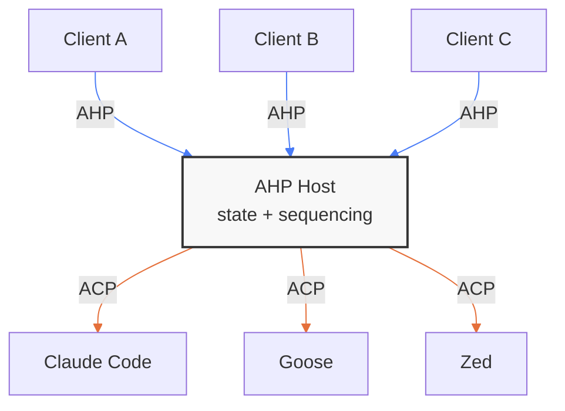

# AHP and the Agent Client Protocol

The [Agent Client Protocol (ACP)](https://github.com/agentclientprotocol/agent-client-protocol) defines how a single client talks to a single AI coding agent — initialization, authentication, prompts, streaming updates, tool calls, and permissions. It is a point-to-point protocol.

The Agent Host Protocol (AHP) solves a different problem: **coordinating N clients over shared agent sessions**. An AHP host manages authoritative state, synchronizes it to every connected client, and sequences all mutations through pure reducers. The host itself needs to talk to agents — and that's where ACP fits in.

**AHP is a coordination layer. ACP is a communication layer. They compose naturally.**

## The Layering

Above the host, AHP handles multi-client problems: state synchronization, write-ahead reconciliation, subscription management, and action sequencing. Below the host, ACP (or any agent-specific interface) handles the 1:1 conversation with the agent — prompt turns, streaming content blocks, tool execution, and permission flows.

The host is the boundary between these two concerns.

## What Each Protocol Owns

| Concern | AHP | ACP |
|---|---|---|
| **Multi-client coordination** | Core purpose — N clients see synchronized state | Not addressed — assumes a single client |
| **State authority** | Host holds the authoritative state tree; clients reconcile | Agent holds session state; client receives updates |
| **Action sequencing** | Server-sequenced action envelopes with `serverSeq` ordering | Request-response with streaming notifications |
| **Reconnection / replay** | Built-in — clients reconnect with `lastSeenServerSeq` and replay missed actions | Not specified at the protocol level |
| **Agent abstraction** | Agent-agnostic by design — clients never see agent-specific details | Agent-specific — defines the agent's interface directly |
| **Session lifecycle** | Host manages sessions; clients subscribe by URI | Client creates sessions directly with the agent |
| **Streaming** | Actions (`session/delta`, `session/responsePart`) applied through reducers | `session/update` notifications sent over the wire |

## How They Compose

An AHP host implementation can use ACP as its agent backend protocol. The internal flow looks like this:

1. **Client calls `startTurn`** via AHP (the rejectable command form; the legacy `session/turnStarted` action is server-emitted only).
2. **Host validates and sequences** — checks the session config, then assigns a `serverSeq`, broadcasts the `session/turnStarted` action envelope to all subscribed clients.
3. **Host translates to ACP** — sends a `session/prompt` to the ACP agent.
4. **Agent streams back** — the ACP agent sends `session/update` notifications with content chunks, tool calls, and permission requests.
5. **Host maps to AHP actions** — the agent event mapper converts ACP-specific events into agent-agnostic AHP actions (`session/delta`, `session/toolStart`, `session/permissionRequest`, etc.).
6. **Host broadcasts** — each mapped action gets a `serverSeq` and flows to all subscribed clients through the normal state synchronization path.

The host is acting as a bridge: it speaks AHP upstream (to clients) and ACP downstream (to agents). The agent event mapper is the translation layer between the two.

## The Mutex Analogy

A useful mental model: **AHP is a mutex over ACP.**

When multiple clients connect to the same agent session, the host serializes their interactions. ACP defines a 1:1 conversation — one prompt, one response, one permission flow. AHP wraps that 1:1 conversation in coordination machinery so that N clients can observe and participate without stepping on each other.

Concretely:

- **Turn ownership**: Only one turn runs at a time. When Client A calls `startTurn`, the host emits a `session/turnStarted` action that Clients B and C see, and they know the session is busy. AHP's state tree makes this visible to everyone.
- **Permission resolution**: When the agent requests permission, the host surfaces it as a state action. Any client can resolve it — but only once (the first `session/permissionResolved` wins; subsequent ones are rejected). The host arbitrates.
- **Cancellation**: Any client can cancel a running turn. The host sequences the `session/turnCancelled` action and forwards the cancellation to the agent via ACP's `session/cancel`. All clients see the result.
- **Optimistic updates with reconciliation**: Clients apply their own actions immediately (write-ahead) and reconcile when the server echoes them back. This gives responsive UI without sacrificing consistency — something a 1:1 protocol doesn't need to worry about.

ACP doesn't need any of this because it assumes one client. AHP adds exactly this coordination, and nothing more — it doesn't redefine how agents work, what tools they expose, or how they stream content.

## What AHP Does Not Do

AHP intentionally stays out of:

- **Agent implementation** — AHP doesn't define how agents process prompts, call tools, or manage context windows. That's the agent's concern (and ACP's domain).
- **Model routing** — The host publishes available agents and models to root state, but the actual LLM calls happen inside the agent backend.
- **Tool definition** — AHP doesn't have a tool registry or tool schema. Tools are agent-internal. The host only sees display-ready metadata after the agent event mapper processes them.
- **Agent-to-agent communication** — AHP coordinates clients, not agents. If agents need to talk to each other, that's a separate concern.

## When to Use Which

**Use ACP** when you're building an agent that needs to talk to a client (an editor, a CLI, a web app). ACP gives you session management, prompt/response cycles, streaming, tool calls, and permissions — everything needed for a single client to drive a single agent.

**Use AHP** when you need multiple clients to share the same agent sessions. AHP gives you state synchronization, action sequencing, write-ahead reconciliation, and subscription management — everything needed to coordinate N clients over shared state.

**Use both** when you're building a host that bridges multiple clients to multiple agents. The host speaks AHP to its clients and ACP to its agents. This is the architecture that the AHP reference implementation targets: a standalone server (or Electron utility process) that manages sessions, synchronizes state, and delegates agent work to ACP-compatible backends.
