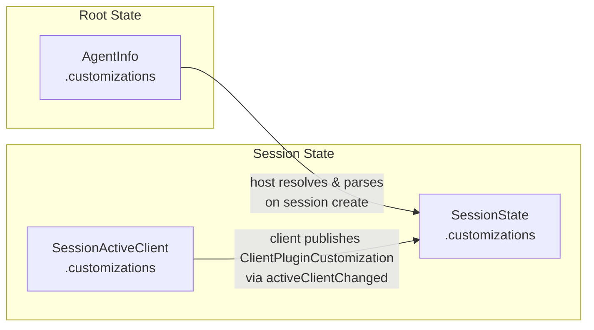
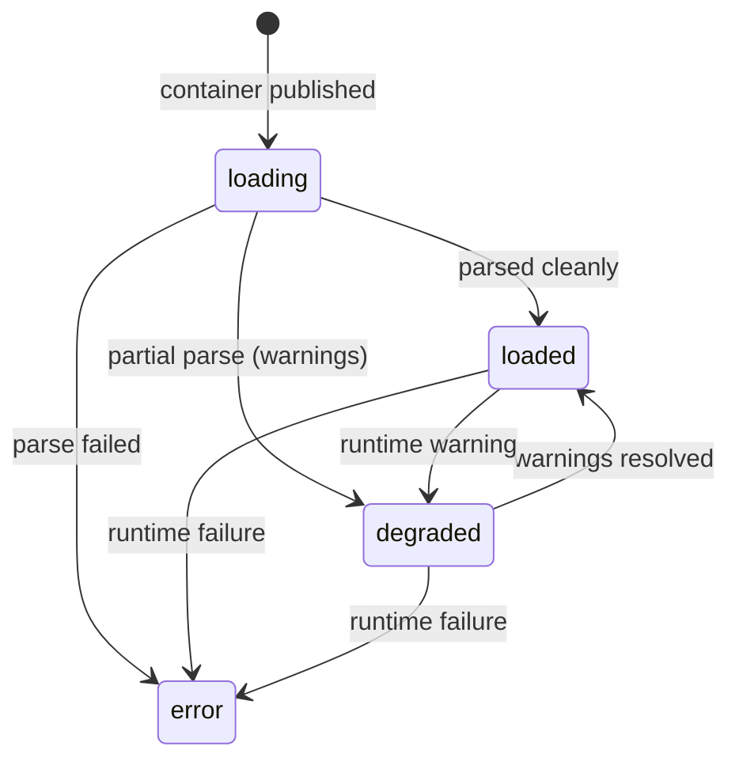
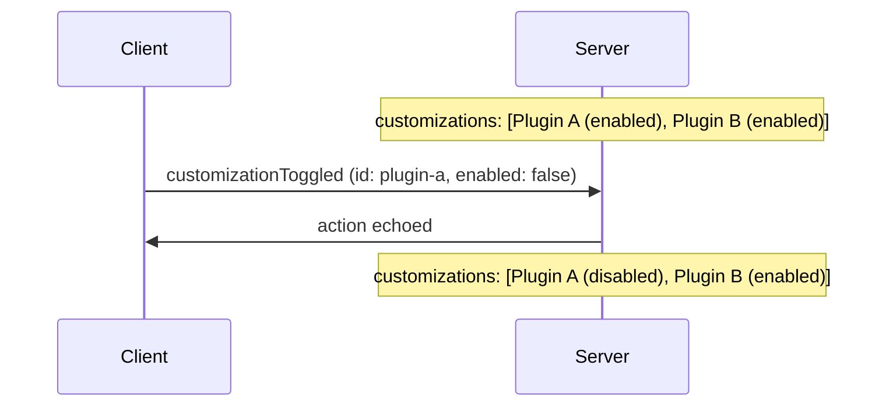
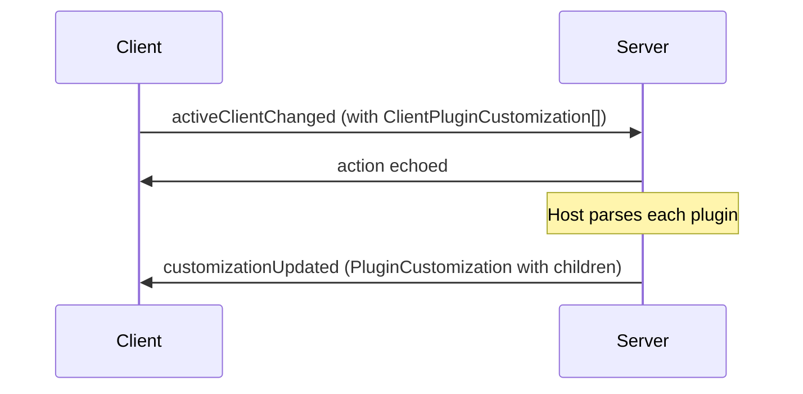
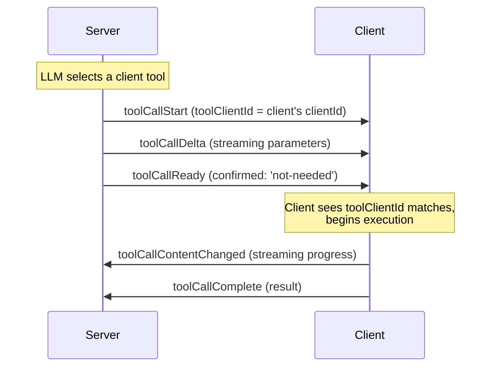
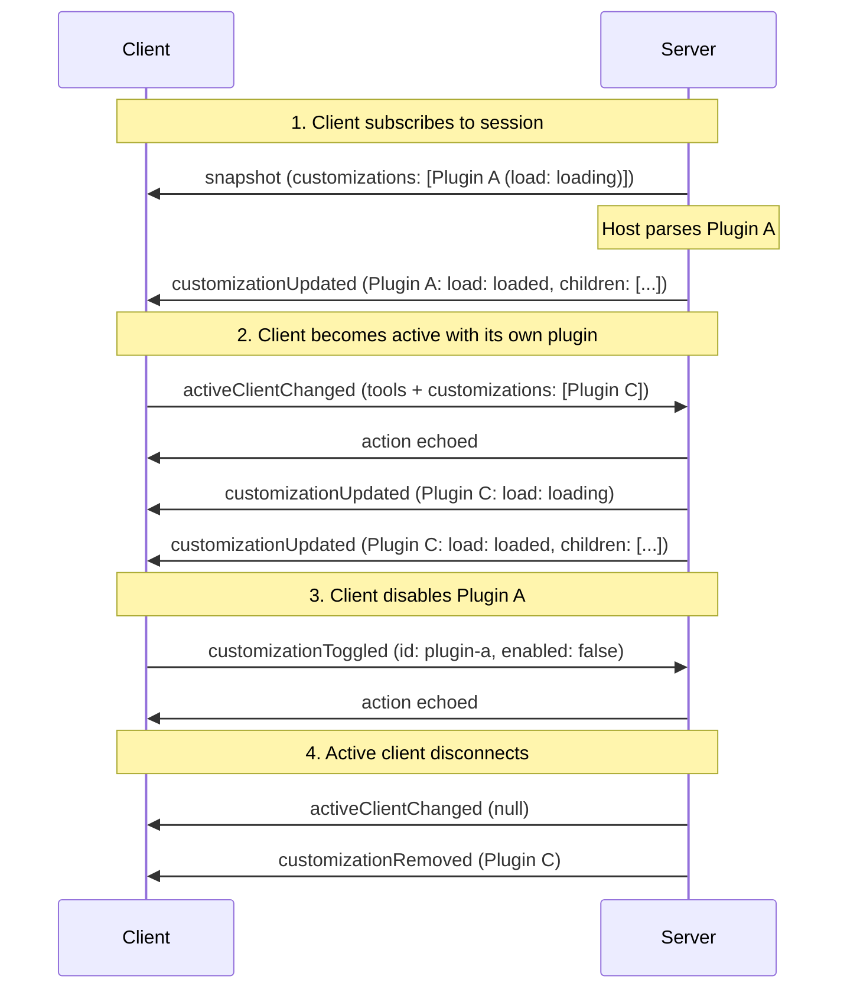

# Customizations

Customizations extend agent sessions with additional capabilities — agents, skills, prompts, rules, hooks, and MCP servers. AHP organises them as a discriminated union with a fixed set of types and a shallow tree:

- **Top-level entries are typically containers**: a `PluginCustomization` (an [Open Plugins](https://open-plugins.com/) package) or a `DirectoryCustomization` (a directory the host watches on disk). The host MAY also surface a bare `McpServerCustomization` at the top level (for example, a globally-configured MCP server that isn't bundled in a plugin).
- **Other children live inside a container**: `AgentCustomization`, `SkillCustomization`, `PromptCustomization`, `RuleCustomization`, `HookCustomization`, `McpServerCustomization`. MCP servers can therefore appear in either position.

The agent host is authoritative on the effective tree. Clients publish plugins, the host expands them into children, and the host owns disk-backed directories and bare top-level MCP servers.

For MCP-specific behaviour (server lifecycle, authentication, App support), see [MCP Servers](/guide/mcp).

## Sources

Customizations enter a session from two places:

1. **Server-provided** — The agent host declares containers on each agent via `AgentInfo.customizations`. When a session is created, the host resolves the containers, parses their contents, and exposes the result in `SessionState.customizations`.
2. **Client-provided** — The active client contributes `ClientPluginCustomization` entries via `SessionActiveClient.customizations` (a `PluginCustomization` with an optional `nonce`). The host MAY parse the published plugin and surface it (with its children) in the session's top-level list.



Clients publish in Open Plugins shape only. They MAY synthesize a virtual plugin in memory if their real source is on disk; mapping a workspace location to a physical directory is the host's job, not the client's.

## Identity

Every customization carries an `id` and a `uri`. They are different concepts:

- **`id`** is a session-unique opaque token. It identifies the entry to every customization action — toggles, updates, and removals. It is minted by whoever publishes the customization (typically the host).
- **`uri`** is the descriptive source URI. For plugins it's the package URL, for directories it's the directory path, and for file-backed children it's the file URI. For inline declarations (e.g. an MCP server declared inside a `plugins.json` manifest) `uri` points at the containing file and the optional **`range`** narrows it to the declaration's span within that file.

Use `id` for protocol operations. Use `uri` for persistent references (e.g. `AgentSelection.uri`, which must survive across sessions).

## Containers

Container customizations carry a host-reported `load` state and a `children` array.

```typescript
PluginCustomization {
  type: 'plugin'
  id: string                     // session-unique handle
  uri: URI                       // plugin URL or marketplace id
  name: string
  icons?: Icon[]
  enabled: boolean
  clientId?: string              // set when published by a client
  load?: CustomizationLoadState  // host-reported parse/load state
  children?: ChildCustomization[]
}

DirectoryCustomization {
  type: 'directory'
  id: string
  uri: URI                       // directory URI
  name: string
  icons?: Icon[]
  enabled: boolean
  clientId?: string
  load?: CustomizationLoadState
  children?: ChildCustomization[]
  contents: ChildCustomizationType  // which child kind lives here
  writable: boolean                 // clients may write into it (via resourceWrite)
}
```

`children` is **absent** when the host has not parsed the container yet, and **empty** when it parsed it and found nothing.

### Load state

`load` is a discriminated union:



| Kind | Meaning |
|---|---|
| `loading` | Host is loading / parsing the container (initial state) |
| `loaded` | Host has fully resolved the container |
| `degraded` | Container partially loaded; `message` describes the warning |
| `error` | Container failed to load; `message` carries the error |

## Children

Every child carries the same base fields (`id`, `uri`, `name`, optional `icons`). Children are leaf nodes — no further nesting — and their parent is implied by which container holds them in its `children` array. Children have no `enabled` or `clientId`: only containers can be toggled, and client provenance lives on the container since clients can only contribute containers, not individual children.

Each child type carries optional metadata sourced from its [Open Plugins](https://open-plugins.com/plugin-builders/specification.md) component definition (typically the file's YAML frontmatter):

```typescript
AgentCustomization        { type: 'agent';       description? }
SkillCustomization        { type: 'skill';       description?, disableModelInvocation? }
PromptCustomization       { type: 'prompt';      description? }
RuleCustomization         { type: 'rule';        description?, alwaysApply?, globs? }    // covers "instruction" formats too
HookCustomization         { type: 'hook';        event?, matcher? }
McpServerCustomization    { type: 'mcpServer';   enabled, state, channel?, mcpApp? }   // see /guide/mcp
```

The protocol intentionally omits host-internal execution details (a hook's command/script, an MCP server's `command`/`args`/`env`, etc.). Those stay on the agent host; clients see only what's needed for display, search, and selection. MCP tools and their descriptions surface through the standard tool channels once the server is running. The MCP-specific runtime fields (`state`, `channel`, `mcpApp`) are covered in [MCP Servers](/guide/mcp).

Consumers filter by `type` to find the children they care about — for example, the agent picker reads every `AgentCustomization` under any container:

```typescript
state.customizations
  ?.flatMap(c => c.children ?? [])
  .filter(c => c.type === CustomizationType.Agent)
```

## Toggling

Any client can enable or disable a top-level container by dispatching `session/customizationToggled` with the container's `id`:

```typescript
{
  type: 'session/customizationToggled'
  id: string         // container id
  enabled: boolean
}
```

Only containers (plugins and directories) have an `enabled` flag — children are always active when their container is enabled. The action is a no-op if no container has that id.



## Server-Side Updates

The host reports container changes via two actions:

- **`session/customizationsChanged`** — full replacement of the top-level list. Use when the entire effective set changes.
- **`session/customizationUpdated`** — upsert one top-level container by `customization.id`. If found, the entry is replaced entirely (including its `children` array); if not, it's appended.

Children are always updated as part of their container. To reflect a per-child change (e.g. a single skill finishing parse), the host re-dispatches `customizationUpdated` with the same container and the updated `children` array. There is no field-level merge and no per-child action.

For removals:

- **`session/customizationRemoved { id }`** — remove a customization by id. If the entry is a top-level container, its children are removed with it. If the entry is a child, only that child is removed. No-op if no matching id is found.

## Saving New Customizations

When a client wants to persist a new customization (e.g. write a new skill file), it targets a `DirectoryCustomization` with `writable: true` and uses [`resourceWrite`](/reference/common#resourcewrite) to write into it. The host watches the directory and surfaces the resulting child by re-dispatching `session/customizationUpdated` for the directory (which carries the updated `children` array).

The protocol does not define a dedicated save action — directories plus `resourceWrite` are enough.

## Client-Published Plugins

A client claims the active role and contributes plugins via `session/activeClientChanged`. Client customizations are `ClientPluginCustomization` values — `PluginCustomization` with an optional `nonce` the host can use to detect changes between publications.

```typescript
dispatch({
  type: 'session/activeClientChanged',
  activeClient: {
    clientId: 'my-client-id',
    displayName: 'VS Code',
    tools: [ /* ... */ ],
    customizations: [
      {
        type: 'plugin',
        id: 'client-plugin-1',
        uri: 'virtual://my-client/workspace-skills',
        name: 'Workspace Skills',
        enabled: true,
        nonce: 'sha256:...',
      },
    ],
  },
});
```

The host parses the plugin and surfaces it in `SessionState.customizations` with `clientId` set and `children` populated. When the active client disconnects or is replaced, the host SHOULD remove its customizations from the session list.



## Client-Provided Tools

AHP sessions can expose tools from two sources: **server tools** provided by the agent host, and **client tools** provided by the active client (e.g. an IDE). Client tools let the agent invoke capabilities that only the client has access to.

Key design points:

- **Client tools are state, not RPC.** They live in `SessionState.activeClient.tools` and are visible to all subscribers.
- **Tool execution follows the same state machine** as server tools — the only difference is _who_ executes: for client tools, the owning client does.
- **The server identifies client tool calls** by setting `toolClientId` on `session/toolCallStart`.

### Registering Tools

A client registers its tools by including them in the `session/activeClientChanged` payload (the same action used to register customizations):

```typescript
// Client claims the active role with tools and customizations
dispatch({
  type: 'session/activeClientChanged',
  session: sessionUri,
  activeClient: {
    clientId: 'my-client-id',
    displayName: 'VS Code',
    tools: [
      {
        name: 'runUnitTests',
        title: 'Run Unit Tests',
        description: 'Runs unit tests in the project',
        inputSchema: {
          type: 'object',
          properties: { pattern: { type: 'string' } }
        },
      },
    ],
    customizations: [ /* ... */ ],
  },
});
```

After registration, the reducer stores the tools in `state.activeClient.tools`.

### Updating Tools

To change the tool list without re-claiming the active role, dispatch `session/activeClientToolsChanged`:

```typescript
dispatch({
  type: 'session/activeClientToolsChanged',
  session: sessionUri,
  tools: updatedToolList, // full replacement
});
```

Both actions use **full-replacement semantics** — the entire `tools` array is replaced.

### Tool Name Uniqueness

Server tools and client tools share a flat namespace (`ToolDefinition.name`). Agent host implementations SHOULD ensure names are unique across both sets — for example by prefixing client tool names.

### Executing a Client Tool Call

When the LLM calls a client-provided tool, the following sequence occurs:



1. **`session/toolCallStart`** — The server dispatches this with `toolClientId` set to the active client's `clientId`. This tells the client it owns the tool call.

2. **`session/toolCallDelta`** (zero or more) — The server streams partial parameters as the LLM generates them. The client can observe `partialInput` on the tool call state to preview the arguments.

3. **`session/toolCallReady`** — Parameters are complete. For client-provided tools, the server typically sets `confirmed: 'not-needed'` so the tool transitions directly to `running`. If the server wants user confirmation first, it omits `confirmed` and the standard confirmation flow applies.

4. **Client executes** — When the tool call reaches `running` status, the owning client begins execution using the `toolInput` from the tool call state.

5. **`session/toolCallContentChanged`** (zero or more, client-dispatched) — While executing, the client MAY stream intermediate content (e.g. terminal output, partial results) by dispatching this action. This replaces the `content` array on the running tool call state.

6. **`session/toolCallComplete`** (client-dispatched) — The client dispatches this with the execution result. The server SHOULD reject this action if the dispatching client does not match `toolClientId`.

### Denying an Unrecognized Tool

If the client receives a tool call for a tool it does not recognize (e.g. after a stale registration), it MUST dispatch `session/toolCallConfirmed` with `approved: false`:

```typescript
dispatch({
  type: 'session/toolCallConfirmed',
  session: sessionUri,
  turnId,
  toolCallId,
  approved: false,
  reason: 'denied',
});
```

### Client Disconnect and Tool Calls

When the active client disconnects, the server SHOULD:

1. Dispatch `session/activeClientChanged` with `activeClient: null` to clear the active client (and its tools and customizations).
2. Allow a reasonable grace period for the client to reconnect.
3. If the client does not reconnect, cancel any in-progress tool calls owned by that client by dispatching `session/toolCallComplete` with `result.success = false` and an appropriate error message.

This ensures tool calls do not remain stuck in `running` state indefinitely.

## Actions Summary

| Type | Client-dispatchable? | When |
|---|---|---|
| `session/customizationsChanged` | No | Server replaced the top-level customization list (full replacement) |
| `session/customizationToggled` | **Yes** | Client toggled a container or child on or off by id |
| `session/customizationUpdated` | No | Server upserts a top-level container by id (full-entry replacement, including children) |
| `session/customizationRemoved` | No | Server removes a customization by id (containers cascade) |
| `session/activeClientChanged` | **Yes** | Client claims/releases the active role (with tools + customizations) |
| `session/activeClientToolsChanged` | **Yes** | Client updates its tool list without re-claiming |
| `session/toolCallStart` | No | Server begins a tool call (sets `toolClientId` for client tools) |
| `session/toolCallComplete` | **Yes** | Client finishes executing a tool call |
| `session/toolCallContentChanged` | **Yes** | Client streams intermediate tool output |

## Full Session Flow



## Next Steps

- [State Model](/guide/state-model) — The state tree that customizations and tools live in, including the tool call lifecycle state machine.
- [Actions](/guide/actions) — How state is mutated by actions.
- [Session Channel Reference](/reference/session) — `SessionActiveClient`, `ToolDefinition`, `ToolCallState`, `Customization`, `ChildCustomization`, and more.
