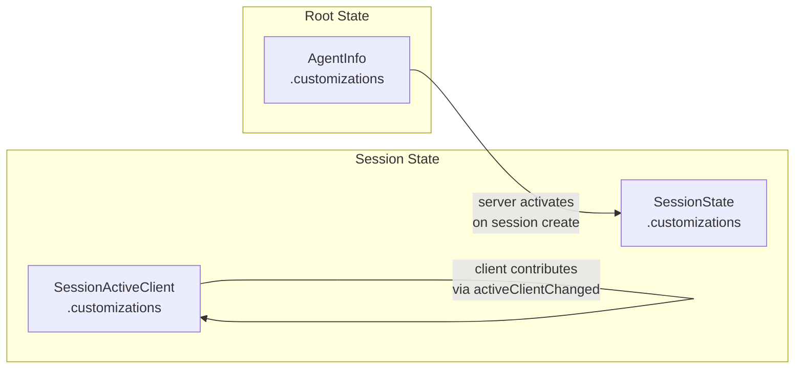
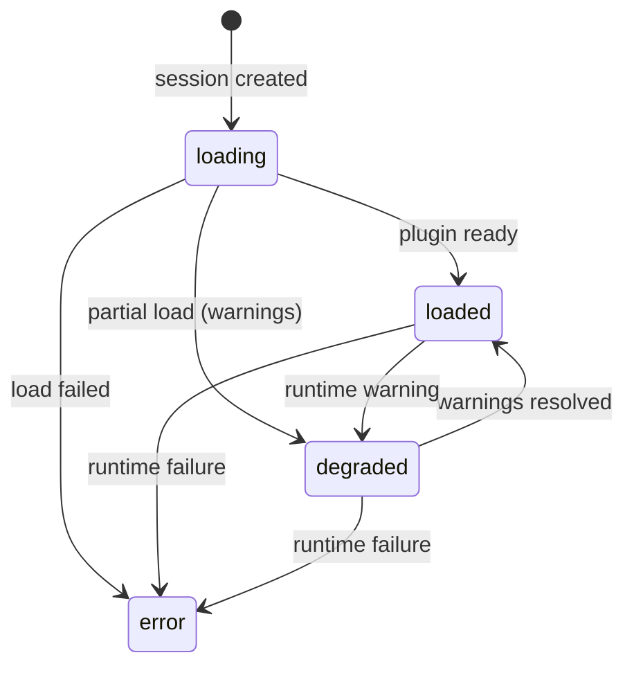
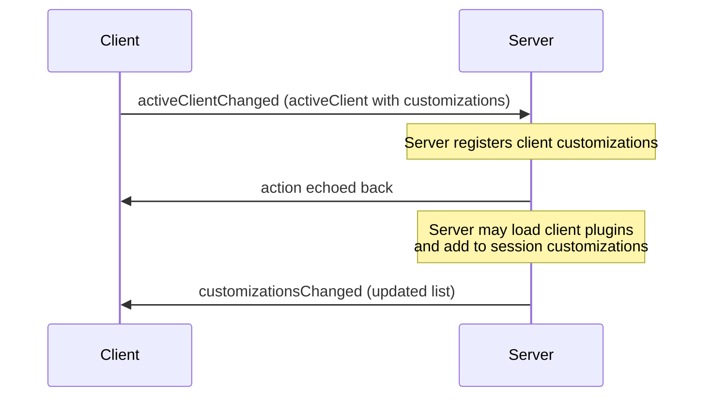
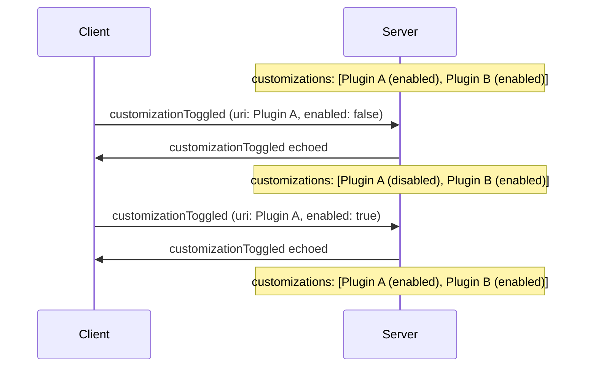
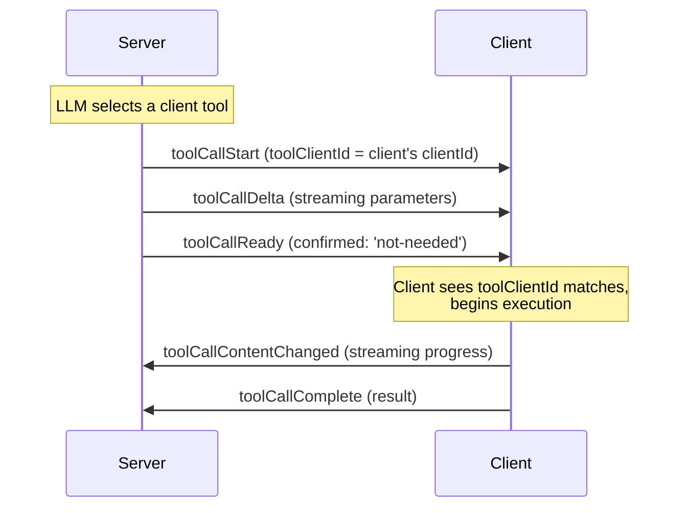
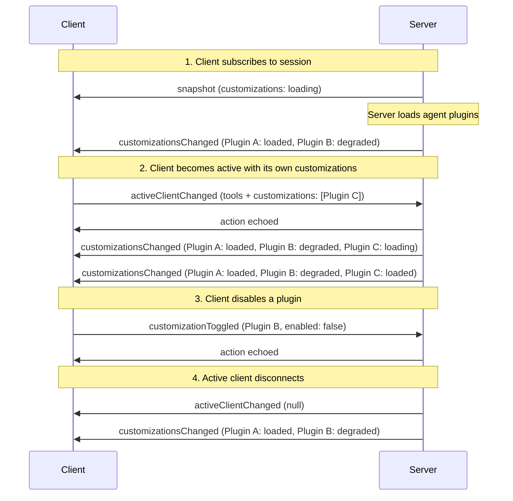

# Customizations

Customizations extend agent sessions with additional capabilities through [Open Plugins](https://open-plugins.com/) — a standard for packaging agent extensions like skills, hooks, MCP servers, and rules into distributable plugins.

AHP treats plugins as opaque references. The protocol specifies identity and metadata (URI, display name, description, icons) but **not** plugin implementation details, which are defined by the Open Plugins specification.

## Sources

Customizations enter a session from two sources:

1. **Server-provided** — The agent host declares customizations on each agent via `AgentInfo.customizations`. When a session is created, the server activates relevant plugins and exposes them in `SessionState.customizations` with loading status.
2. **Client-provided** — The active client contributes customizations via `SessionActiveClient.customizations`. These are lightweight references that the server may act on (e.g. loading the plugin server-side).



## Customization Reference

A `CustomizationRef` identifies a plugin with minimal metadata:

```typescript
CustomizationRef {
  uri: URI             // plugin URI (HTTPS URL, marketplace ID, etc.)
  displayName: string  // human-readable name
  description?: string // what the plugin provides
  icons?: Icon[]       // icons for UI display
  nonce?: string       // opaque version token for change detection
}
```

The `uri` is the stable identity for a customization — it is used to match customizations across sources and for toggling.

## Server Customizations

Server-provided customizations are exposed in `SessionState.customizations` as `SessionCustomization` entries. Each entry wraps a `CustomizationRef` with session-specific state:

```typescript
SessionCustomization {
  customization: CustomizationRef
  enabled: boolean
  status?: 'loading' | 'loaded' | 'degraded' | 'error'
  statusMessage?: string
}
```

### Loading Status

The server reports the loading state of each plugin it manages:



| Status | Meaning |
|---|---|
| `loading` | Plugin is being loaded (initial state) |
| `loaded` | Plugin is fully operational |
| `degraded` | Plugin partially loaded — some components work but there are warnings. `statusMessage` describes the issue. |
| `error` | Plugin failed to load entirely. `statusMessage` contains the error. |

The server updates `SessionState.customizations` via the `session/customizationsChanged` action whenever loading status changes. This action uses full-replacement semantics — the entire array is replaced.

## Client Customizations

The active client contributes customizations by including them in `SessionActiveClient.customizations` when claiming the active role (via `session/activeClientChanged`) or updating tools (via `session/activeClientToolsChanged`).

Client customizations are `CustomizationRef` values — the client declares which plugins it has, and the server may choose to act on them (e.g. loading them server-side or surfacing them in the session's customization list).



When the active client disconnects or is replaced, its customizations are no longer available. The server SHOULD update `SessionState.customizations` accordingly.

## Session-Scoped Host Configuration

The protocol intentionally treats plugin resolution as implementation-defined. For remote/browser clients, a useful pattern is to let the host resolve plugins from session configuration or workspace/server files, then publish the effective set through `SessionState.customizations`.

For example, a host might:

1. read a workspace file such as `.vscode/agent-host.json`
2. expose the effective plugin list through `resolveSessionConfig`
3. load those plugins when creating or resuming the session
4. publish them as `SessionCustomization` entries (without `clientId`)

This keeps plugin configuration usable from thin clients without extending AHP with plugin-install semantics.

## Toggling Customizations

Any client can enable or disable a customization by dispatching `session/customizationToggled`:

```typescript
{
  type: 'session/customizationToggled'
  session: URI
  uri: URI         // customization to toggle
  enabled: boolean // new enabled state
}
```

This matches the customization by its `uri` field and sets `enabled`. The server applies the toggle and may react by activating or deactivating the plugin.



## Reporting Customization Updates

The server reports plugin state via the `enabled`, `status` (`loading` / `loaded` / `degraded` / `error`) and `statusMessage` fields on each `SessionCustomization`. To change one or more of these for a single plugin — for example, when a plugin finishes loading or fails — the server dispatches `session/customizationUpdated` instead of republishing the entire `customizations` list:

```typescript
{
  type: 'session/customizationUpdated'
  session: URI
  customization: CustomizationRef // matched by `customization.uri`
  enabled?: boolean               // omit to leave unchanged (defaults to false on insert)
  status?: CustomizationStatus    // omit to leave unchanged
  statusMessage?: string          // omit to leave unchanged
}
```

This action is an upsert. The reducer locates the entry by `customization.uri`:

- If found, the stored `customization` ref is replaced with the one in the action and each provided mutable field is assigned. Absent fields are left unchanged.
- If not found, a new entry is appended using the provided fields. `enabled` defaults to `false` when absent.

## Client-Provided Tools

AHP sessions can expose tools from two sources: **server tools** provided by the agent host, and **client tools** provided by the active client (e.g. an IDE). Client tools let the agent invoke capabilities that only the client has access to.

Key design points:

- **Client tools are state, not RPC.** They live in `SessionState.activeClient.tools` and are visible to all subscribers.
- **Tool execution follows the same state machine** as server tools — the only difference is _who_ executes: for client tools, the owning client does.
- **The server identifies client tool calls** by setting `toolClientId` on `session/toolCallStart`.

### Registering Tools

A client registers its tools by including them in the `session/activeClientChanged` payload (the same action used to register customizations):

```typescript
// Client claims the active role with tools and customizations
dispatch({
  type: 'session/activeClientChanged',
  session: sessionUri,
  activeClient: {
    clientId: 'my-client-id',
    displayName: 'VS Code',
    tools: [
      {
        name: 'runUnitTests',
        title: 'Run Unit Tests',
        description: 'Runs unit tests in the project',
        inputSchema: {
          type: 'object',
          properties: { pattern: { type: 'string' } }
        },
      },
    ],
    customizations: [ /* ... */ ],
  },
});
```

After registration, the reducer stores the tools in `state.activeClient.tools`.

### Updating Tools

To change the tool list without re-claiming the active role, dispatch `session/activeClientToolsChanged`:

```typescript
dispatch({
  type: 'session/activeClientToolsChanged',
  session: sessionUri,
  tools: updatedToolList, // full replacement
});
```

Both actions use **full-replacement semantics** — the entire `tools` array is replaced.

### Tool Name Uniqueness

Server tools and client tools share a flat namespace (`ToolDefinition.name`). Agent host implementations SHOULD ensure names are unique across both sets — for example by prefixing client tool names.

### Executing a Client Tool Call

When the LLM calls a client-provided tool, the following sequence occurs:



1. **`session/toolCallStart`** — The server dispatches this with `toolClientId` set to the active client's `clientId`. This tells the client it owns the tool call.

2. **`session/toolCallDelta`** (zero or more) — The server streams partial parameters as the LLM generates them. The client can observe `partialInput` on the tool call state to preview the arguments.

3. **`session/toolCallReady`** — Parameters are complete. For client-provided tools, the server typically sets `confirmed: 'not-needed'` so the tool transitions directly to `running`. If the server wants user confirmation first, it omits `confirmed` and the standard confirmation flow applies.

4. **Client executes** — When the tool call reaches `running` status, the owning client begins execution using the `toolInput` from the tool call state.

5. **`session/toolCallContentChanged`** (zero or more, client-dispatched) — While executing, the client MAY stream intermediate content (e.g. terminal output, partial results) by dispatching this action. This replaces the `content` array on the running tool call state.

6. **`session/toolCallComplete`** (client-dispatched) — The client dispatches this with the execution result. The server SHOULD reject this action if the dispatching client does not match `toolClientId`.

### Denying an Unrecognized Tool

If the client receives a tool call for a tool it does not recognize (e.g. after a stale registration), it MUST dispatch `session/toolCallConfirmed` with `approved: false`:

```typescript
dispatch({
  type: 'session/toolCallConfirmed',
  session: sessionUri,
  turnId,
  toolCallId,
  approved: false,
  reason: 'denied',
});
```

### Client Disconnect and Tool Calls

When the active client disconnects, the server SHOULD:

1. Dispatch `session/activeClientChanged` with `activeClient: null` to clear the active client (and its tools and customizations).
2. Allow a reasonable grace period for the client to reconnect.
3. If the client does not reconnect, cancel any in-progress tool calls owned by that client by dispatching `session/toolCallComplete` with `result.success = false` and an appropriate error message.

This ensures tool calls do not remain stuck in `running` state indefinitely.

## Actions Summary

| Type | Client-dispatchable? | When |
|---|---|---|
| `session/customizationsChanged` | No | Server updated the session's customization list (full replacement) |
| `session/customizationToggled` | **Yes** | Client toggled a customization on or off |
| `session/customizationUpdated` | No | Server upserts mutable fields on a single customization |
| `session/activeClientChanged` | **Yes** | Client claims/releases the active role (with tools + customizations) |
| `session/activeClientToolsChanged` | **Yes** | Client updates its tool list without re-claiming |
| `session/toolCallStart` | No | Server begins a tool call (sets `toolClientId` for client tools) |
| `session/toolCallComplete` | **Yes** | Client finishes executing a tool call |
| `session/toolCallContentChanged` | **Yes** | Client streams intermediate tool output |

## Full Session Flow



## Next Steps

- [State Model](/guide/state-model) — The state tree that customizations and tools live in, including the tool call lifecycle state machine.
- [Actions](/guide/actions) — How state is mutated by actions.
- [State Types Reference](/reference/state-types) — `SessionActiveClient`, `ToolDefinition`, `ToolCallState`, `CustomizationRef`, and more.
