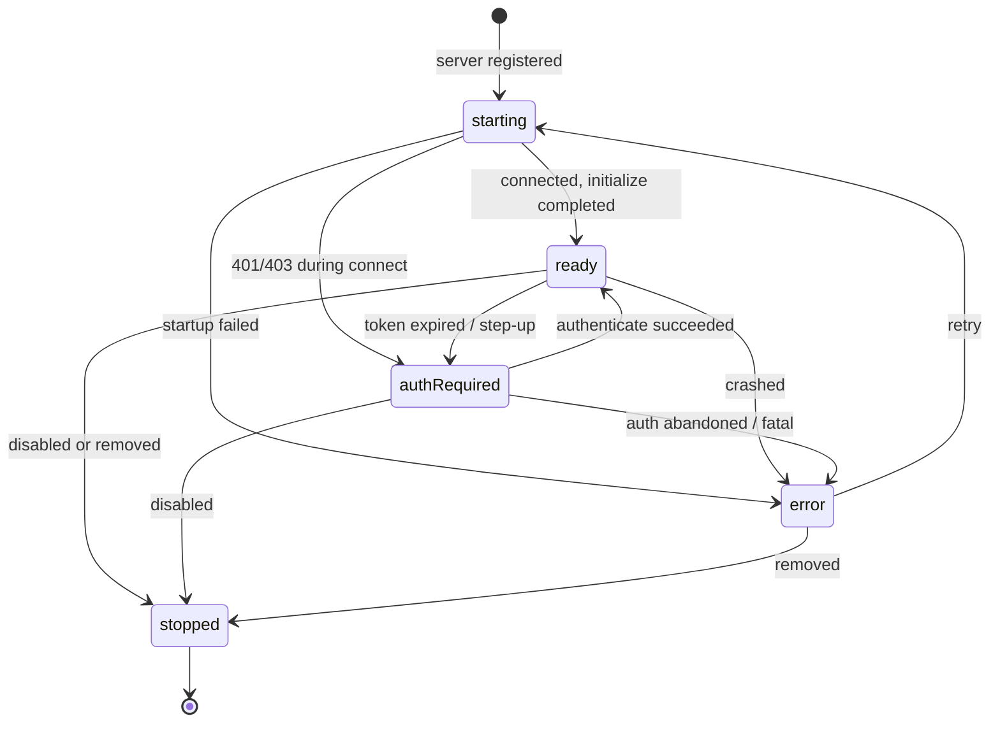
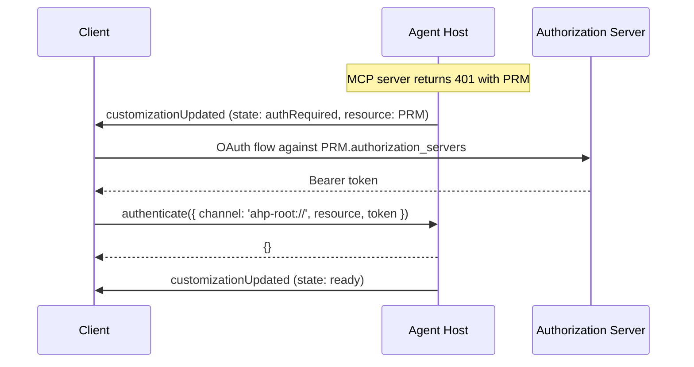
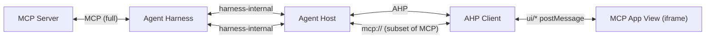

# MCP Servers

[Model Context Protocol](https://modelcontextprotocol.io/) servers are surfaced in AHP as a [`McpServerCustomization`](/reference/session#mcpservercustomization) — a customization that represents one running (or registered) MCP server within a session. AHP intentionally does **not** re-spec MCP. It exposes:

- Enough state for clients to render the server (name, icon, enabled flag, runtime status).
- Enough state for clients to drive authentication when the server demands it.
- An optional [`mcp://` side-channel](/specification/mcp-channel) the client can use to talk to the upstream server when it needs to render an [MCP App](#mcp-apps).

Everything else — connection management, transport, the server's `command`/`args`/`env`, tool discovery, request fan-out — lives in the agent harness the host wraps. The agent host's job is to normalize whatever the harness exposes into AHP state.

## Where MCP servers appear

MCP servers may appear in two positions in [`SessionState.customizations`](/reference/session#sessionstate):

1. **As a child** of a container customization — for example, an MCP server declared inside a `plugins.json` manifest or discovered in a directory. The container's `uri` points at the manifest file; the child's `range` narrows it to the declaration's span.
2. **As a bare top-level entry** — the host MAY surface MCP servers directly when they are globally configured rather than bundled in a plugin or directory.

Clients only ever publish customizations through `ClientPluginCustomization`, so client-contributed MCP servers always arrive as children of a client plugin. Top-level `McpServerCustomization` entries are always host-originated.

```typescript
state.customizations
  ?.flatMap(c => c.type === 'mcpServer' ? [c] : (c.children ?? []))
  .filter(c => c.type === 'mcpServer')
```

## Shape

```typescript
McpServerCustomization {
  type: 'mcpServer'
  id: string                     // session-unique handle
  uri: URI                       // declaration source (file or marketplace URL)
  name: string
  icons?: Icon[]
  range?: TextRange              // span inside `uri` for inline declarations
  enabled: boolean               // user-toggleable (see Customizations guide)
  state: McpServerState // discriminated union — see below
  channel?: URI                  // optional mcp:// side-channel
  mcpApp?: McpServerCustomizationApps
}
```

`enabled` follows the same model as any other container — it's toggled with `session/customizationToggled`. Disabling a server signals the host to stop it; the host then transitions the runtime through `stopped` and removes it from the session (or leaves it as `stopped` until removal, host's choice).

## Runtime status

`state` is a [discriminated union on `kind`](/reference/session#mcpserverstatus). It is the host's view of the server's lifecycle, separate from `enabled` (which is the user's intent).



| Kind | Meaning |
|---|---|
| `starting` | Registered but not yet running. Tools/resources are not available. |
| `ready` | Running and serving requests. Tools/resources surface through the usual channels. |
| `authRequired` | Reachable but blocked on authentication. Carries `ProtectedResourceMetadata` for the client to act on. |
| `error` | Unrecoverable failure. Carries an `ErrorInfo`. Use `authRequired` for auth-specific failures. |
| `stopped` | Shut down. The host MAY remove the entry shortly after. |

High-frequency lifecycle transitions go through the narrow [`session/mcpServerStateChanged`](/reference/session#sessionmcpserverstatuschangedaction) action, which upserts just `state` (and optionally `channel`) on an existing entry. Use `session/customizationUpdated` for anything else (name, icons, `mcpApp`).

## Authentication

AHP reuses the existing [`authenticate`](/reference/common#authenticate) command for MCP server authentication. The flow is **driven entirely by state** — there is no MCP-specific notification.



`McpServerAuthRequiredState` carries:

- **`reason`** — `required`, `expired`, or `insufficientScope`. Mirrors the [MCP authorization spec](https://modelcontextprotocol.io/specification/2025-11-25/basic/authorization.md) failure modes.
- **`resource`** — [`ProtectedResourceMetadata`](/reference/common#protectedresourcemetadata) per [RFC 9728](https://datatracker.ietf.org/doc/html/rfc9728). The `resource` field inside is the canonical MCP server URI (per RFC 8707) and what the client passes back as `authenticate({ resource })`.
- **`requiredScopes`** — Scopes parsed from `WWW-Authenticate: Bearer scope="…"`. Authoritative for the next authorization request; clients MUST NOT assume any relationship to `resource.scopes_supported`.
- **`description`** — Human-readable hint, typically the OAuth `error_description`.

### Mid-tool-call step-up auth

`reason: 'insufficientScope'` almost always surfaces *during* a tool call — the model invokes an MCP tool, the upstream server responds 403, and a turn that was happily streaming suddenly needs the user to grant more access. AHP couples this case through two signals so it can't be missed:

1. **The host SHOULD raise [`SessionStatus.InputNeeded`](/reference/session#sessionstatus) on the session** when it transitions an MCP server to `authRequired` because of an in-flight request. This makes the block visible at the session-summary level, exactly like a tool confirmation or input request.
2. **Clients SHOULD watch the `state.kind` of any MCP server backing a running tool call** (via [`ToolCallContributor`](/reference/session#toolcallcontributor) — `{ kind: 'mcp', customizationId }`). When that server flips to `authRequired`, the client SHOULD present an explicit affordance tied to *that tool call* (e.g. an inline "grant additional access" button), rather than relying on the user to spot a status badge on the server's customization entry.

The same monitoring pattern also covers `reason: 'expired'` mid-turn — the difference is purely whether the user needs to re-authenticate or grant additional scopes.

Per-agent protected resources in [`AgentInfo.protectedResources`](/reference/root#agentinfo) cover agents themselves. MCP server resources are advertised here, on the customization, so a single agent can carry an arbitrary number of MCP servers each with their own authorization servers without bloating the root state.

::: tip
The existing `authenticate` command requires `resource` to match one declared by an agent. Hosts that surface MCP server auth via `McpServerAuthRequiredState` either need to widen that rule or mirror MCP server resources into `AgentInfo.protectedResources` until the dedicated MCP actions land. This is a known gap and will be tightened when the MCP-specific action surface is specified.
:::

## Where MCP tools live

MCP tools follow the normal AHP tool-call flow:

- The agent harness inside the host discovers tools from each `ready` MCP server, the host normalizes them into the agent's tool catalogue, and exposes invocations through `chat/toolCallStart` / `chat/toolCallReady` / `chat/toolCallComplete`.
- The originating MCP server is identified by [`ToolCallContributor`](/reference/session#toolcallcontributor) on the tool call: `{ kind: 'mcp', customizationId: <McpServerCustomization.id> }`. Clients can use this to render the originating server's name/icon next to the tool call.

There is no separate "MCP tool" state. From the client's perspective an MCP tool call is just a tool call with an MCP contributor.

## MCP Apps

[MCP Apps](https://github.com/modelcontextprotocol/ext-apps/blob/main/specification/draft/apps.mdx) (SEP-1865) let an MCP server ship a UI resource — typically an HTML page — that a host renders for a specific tool call. The View runs inside a sandbox controlled by the AHP client and talks back via JSON-RPC over `postMessage`. AHP's role is to give the client everything it needs to render that View on behalf of the agent host — and nothing more.

This section describes the AHP-level plumbing only. For the View ↔ host protocol itself (the `ui/*` methods, `hostCapabilities`, `hostContext`, sandboxing rules), see the upstream MCP Apps spec.

### Division of labour



- **Agent harness**: holds the underlying MCP connection to the server. How the harness exposes that to the agent host (proxy, callback, message bus, etc.) is harness-defined and outside AHP.
- **Agent host**: normalizes whatever the harness gives it into AHP state. Decides which tool calls instantiate an App. Forwards the constrained subset of MCP traffic the client sends over the [`mcp://` channel](/specification/mcp-channel) into the harness.
- **AHP client**: declares `capabilities.mcpApps` on `initialize`. Renders the View. Runs the `ui/initialize` handshake. Provides `hostContext` (theme, locale, dimensions, etc.) and the locally-decided parts of `hostCapabilities` (`openLinks`, `downloadFile`, `sandbox`, `experimental`). Delivers tool input/result notifications to the View. Routes `tools/*`, `resources/*`, `logging/*`, and `sampling/*` over the `mcp://` channel.
- **View**: an opaque HTML document the client treats as untrusted. AHP says nothing about it directly.

The client is the *only* party that talks to the View. AHP carries no `ui/*` traffic — that protocol lives between the client and the iframe.

### Declaring support

A client opts in by setting [`InitializeParams.capabilities.mcpApps`](/reference/common#initializeparams) to `{}`. Hosts SHOULD only populate `mcpApp` (and expose the corresponding `mcp://` channel) on customizations served to clients that declared the capability. Clients that omit it MUST treat App-bearing tool calls as ordinary MCP tool calls.

### Discovering App support

Each [`McpServerCustomization`](/reference/session#mcpservercustomization) MAY advertise App support via `mcpApp`:

```typescript
McpServerCustomization {
  // ...
  channel?: URI
  mcpApp?: {
    capabilities: AhpMcpUiHostCapabilities
  }
}
```

`mcpApp` SHOULD be present whenever the server can host Apps. Its presence tells the client "if a tool call from this server points at a UI resource, you can render it as an App, and here is the slice of `hostCapabilities` I can satisfy on your behalf".

[`AhpMcpUiHostCapabilities`](/reference/session#ahpmcpuihostcapabilities) is deliberately a **subset** of the upstream `HostCapabilities`. It only covers capabilities that depend on the host's relationship with the upstream MCP server:

| AHP capability | What the host promises | What the client passes to `ui/initialize` |
|---|---|---|
| `serverTools` | `tools/list` and `tools/call` will be proxied via the `mcp://` channel. `listChanged` controls whether `notifications/tools/list_changed` is forwarded. | `hostCapabilities.serverTools` (mirroring `listChanged`) |
| `serverResources` | `resources/list`, `resources/templates/list`, and `resources/read` will be proxied. `listChanged` controls notification forwarding. | `hostCapabilities.serverResources` |
| `logging` | `notifications/message` from the App will be forwarded to the server; `logging/setLevel` from the server will reach the App. | `hostCapabilities.logging` (`{}`) |
| `sampling` | `sampling/createMessage` from the App will be handled inside the agent host (typically by the same harness that runs the agent's turns). `sampling.tools` controls SEP-1577 content acceptance. | `hostCapabilities.sampling` |

The other `hostCapabilities` fields — `openLinks`, `downloadFile`, `sandbox`, `experimental` — depend on the client's renderer (web vs. desktop, what permissions it can grant, what CSP it enforces) and are **not** part of `AhpMcpUiHostCapabilities`. The client fills them in itself before responding to `ui/initialize`.

### Identifying an App tool call

A tool call that should render as an App carries two AHP-level signals:

1. **`contributor`** — `{ kind: 'mcp', customizationId }` points at the originating [`McpServerCustomization`](/reference/session#mcpservercustomization). Look up `mcpApp` and `channel` on that customization.
2. **`_meta.ui`** — the AHP tool call's `_meta` MAY carry a `ui` field mirroring MCP Apps' `McpUiToolMeta` verbatim (typically `{ resourceUri?: string, visibility?: ('model' | 'app')[] }`). The client SHOULD read `resourceUri` to know which UI resource backs the call. AHP does not retype this shape — clients consume it through `_meta`.

If `_meta.ui.resourceUri` is absent, the tool call is an ordinary MCP tool call and the client renders it normally.

### End-to-end flow

```mermaid
sequenceDiagram
    participant Server as MCP Server
    participant Host as Agent Host
    participant Client as AHP Client
    participant View

    Note over Host,Client: Session subscription; mcpApp.capabilities visible

    Host->>Client: toolCallStart (contributor.mcp, _meta.ui.resourceUri)
    Host->>Client: toolCallReady

    Note over Client: Resolve resource via mcp:// (resources/read)
    Client->>Host: mcp:// resources/read (resourceUri)
    Host->>Server: resources/read
    Server-->>Host: HTML / metadata
    Host-->>Client: HTML / metadata

    Note over Client: Mount iframe, await View
    View->>Client: ui/initialize (postMessage)
    Client-->>View: ui/initialize result<br/>(hostCapabilities = local + mcpApp.capabilities,<br/>hostContext = theme/locale/dimensions)
    View->>Client: ui/notifications/initialized

    Note over Client: Pump tool input + result into the View
    Client->>View: ui/notifications/tool-input
    Host->>Client: toolCallComplete (result)
    Client->>View: ui/notifications/tool-result

    Note over View,Server: View now serves a UI; calls into MCP via the client
    View->>Client: tools/call (server tool)
    Client->>Host: mcp:// tools/call
    Host->>Server: tools/call
    Server-->>Host: result
    Host-->>Client: result
    Client-->>View: result
```

The client is responsible for translating any locally-supported `ui/*` request into the right local affordance — e.g. `ui/open-link` opens a system link, `ui/request-display-mode` toggles the renderer's layout, `ui/message` becomes a steering message or queued message on the AHP session, `ui/update-model-context` becomes an attachment or `Message._meta` field on the next user message.

## Next steps

- [`mcp://` channel](/specification/mcp-channel) — the side-channel clients use to talk to the upstream server.
- [Session Channel Reference](/reference/session) — full type definitions for `McpServerCustomization`, `McpServerState`, and friends.
