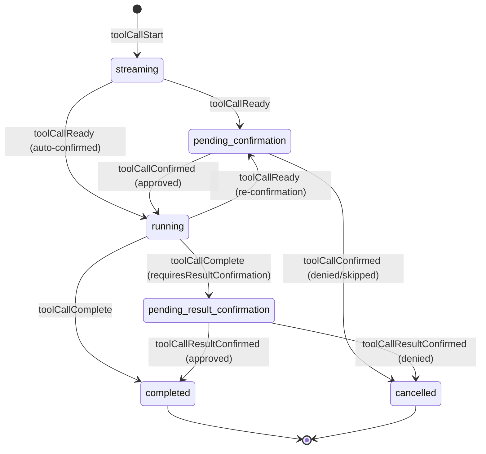
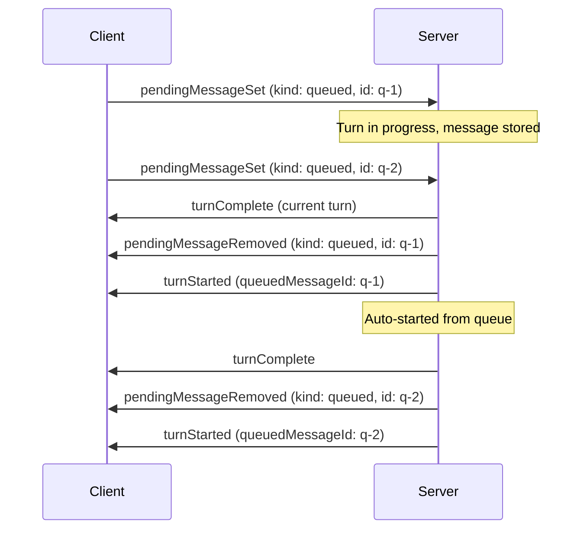
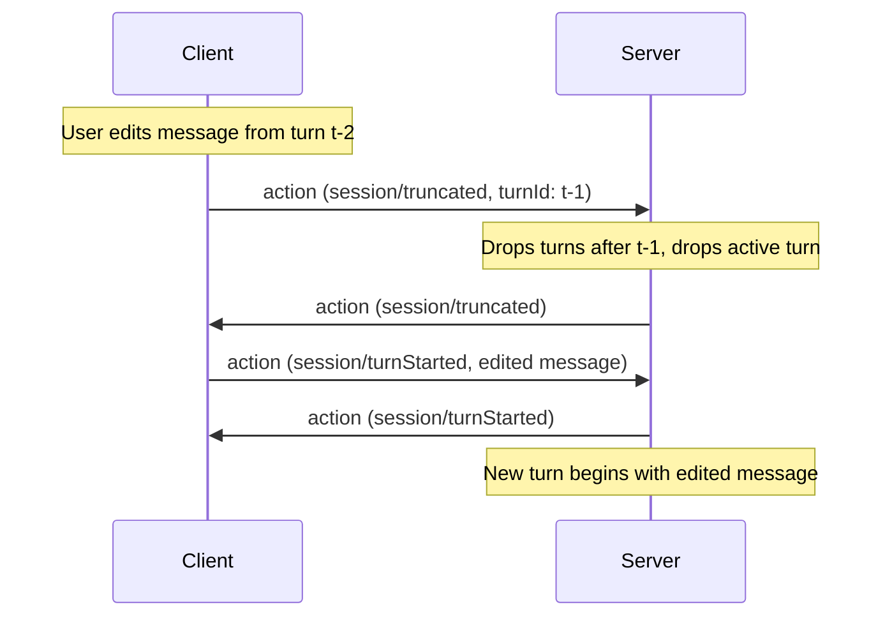

# State Model

All state in AHP is organised into **channels**, each addressed by a URI. Clients subscribe to a channel URI to receive its current state snapshot and subsequent action updates. See [Channels & Subscriptions](/specification/subscriptions) for the channel model.

## Root State

Subscribable on the [Root Channel](/specification/root-channel) at `ahp-root://`. Contains global, lightweight data that all clients need. **Does not contain the session list** — that is fetched imperatively via RPC (see [Commands](/reference/commands)) and kept in sync via `root/sessionAdded` / `root/sessionRemoved` / `root/sessionSummaryChanged` notifications.

```typescript
RootState {
  agents: AgentInfo[]
  activeSessions?: number     // count of non-disposed sessions
  terminals?: TerminalInfo[]  // lightweight terminal catalogue
  config?: RootConfigState    // host-level configuration
}
```

Each `AgentInfo` includes the models available for that agent:

```typescript
AgentInfo {
  provider: string         // e.g. 'copilot'
  displayName: string
  description: string
  models: ModelInfo[]
  customizations?: CustomizationRef[]  // Open Plugins
}

ModelInfo {
  id: string
  provider: string
  name: string
  maxContextWindow?: number
  supportsVision?: boolean
  policyState?: 'enabled' | 'disabled' | 'unconfigured'
  configSchema?: ConfigSchema   // model-specific options (e.g. thinking level)
  _meta?: Record<string, unknown>  // intrinsic facts (e.g. pricing); see below
}

ConfigSchema {
  type: 'object'
  properties: Record<string, ConfigPropertySchema>
  required?: string[]
}

ConfigPropertySchema {
  type: 'string'
  title: string
  description?: string
  default?: string
  enum: string[]                 // allowed values
  enumLabels?: string[]          // display labels (parallel array)
  enumDescriptions?: string[]    // descriptions (parallel array)
  readOnly?: boolean
}
```

When a model has a `configSchema`, clients present it as a form and pass the resolved values in a `ModelSelection` (see [Session Summary](#session-summary)).

`_meta` carries additional provider-specific metadata. Clients MAY look for well-known keys here to provide enhanced UI — for example, a `pricing` key may carry model pricing metadata.

Root state is mutated only by server-originated actions (e.g. `root/agentsChanged`).

## Session State

Subscribable on a [Session Channel](/specification/session-channel) at `ahp-session:/<uuid>`. Contains the full state for a single session.

```typescript
SessionState {
  summary: SessionSummary
  lifecycle: 'creating' | 'ready' | 'creationFailed'
  creationError?: ErrorInfo
  turns: Turn[]
  activeTurn: ActiveTurn | undefined
  inputRequests?: SessionInputRequest[]
  customizations?: SessionCustomization[]  // active session plugins
}
```

### Lifecycle

The `lifecycle` field tracks the asynchronous creation process. When a client creates a session, it picks a URI, sends the command, and subscribes immediately. The initial snapshot has `lifecycle: 'creating'`. The server asynchronously initializes the backend and dispatches `session/ready` or `session/creationFailed`.

### Session Summary

Lightweight metadata used in the session list and embedded within session state:

```typescript
SessionSummary {
  resource: URI
  provider: string
  title: string
  status: number  // SessionStatus bitset
  activity?: string
  createdAt: numberR
  modifiedAt: number
  project?: ProjectInfo
  model?: ModelSelection
  workingDirectory?: URI
}

ModelSelection {
  id: string                             // model ID
  config?: Record<string, string>        // model-specific config values
}

ProjectInfo {
  uri: URI
  displayName: string
}
```

The `status` bitset encodes both the session's activity state and metadata flags like read/archived state. See the [Session Status Bitset](#session-status-bitset) table below for details.

### Session Status Bitset

`summary.status` is a numeric bitset. Clients SHOULD use bitwise checks instead of string or equality checks for activity states:

| Name                        | Value | Bits                   | Meaning                                                                                                                                                                               |
| --------------------------- | ----: | ---------------------- | ------------------------------------------------------------------------------------------------------------------------------------------------------------------------------------- |
| `SessionStatus.Idle`        |   `1` | `1 << 0`               | No active turn and no pending input request.                                                                                                                                          |
| `SessionStatus.Error`       |   `2` | `1 << 1`               | The most recent turn ended with an error.                                                                                                                                             |
| `SessionStatus.InProgress`  |   `8` | `1 << 3`               | A turn is active.                                                                                                                                                                     |
| `SessionStatus.InputNeeded` |  `24` | `(1 << 3) \| (1 << 4)` | A turn is active and either at least one user input request is open, or at least one tool call is awaiting user confirmation (pre- or post-execution). Includes the `InProgress` bit. |
| `SessionStatus.IsRead`      |  `32` | `1 << 5`               | The client has viewed this session since its last modification. Cleared automatically when a new turn starts or an input request arrives. Toggled via `session/isReadChanged`.        |
| `SessionStatus.IsArchived`  |  `64` | `1 << 6`               | The session has been archived by the client. Toggled via `session/isArchivedChanged`.                                                                                                 |

Bits 0–4 encode mutually-exclusive **activity** status (exactly one is set at a time). Bits 5+ encode orthogonal **metadata** flags that may be combined with any activity status via bitwise OR.

For example, `(status & SessionStatus.InProgress) !== 0` is true for both `InProgress` and `InputNeeded`. A session that is idle, read, and archived has status `1 | 32 | 64 = 97`.

## Turns

A turn represents one request/response cycle between user and agent.

### Completed Turn

```typescript
Turn {
  id: string
  userMessage: UserMessage
  responseParts: ResponsePart[]     // all content in stream order
  usage: UsageInfo | undefined
  state: 'complete' | 'cancelled' | 'error'
  error?: ErrorInfo
}
```

### Active Turn

An in-progress turn where the assistant is actively streaming:

```typescript
ActiveTurn {
  id: string
  userMessage: UserMessage
  responseParts: ResponsePart[]     // all content in stream order
  usage: UsageInfo | undefined
}
```

### User Messages

```typescript
UserMessage {
  text: string
  attachments?: MessageAttachment[]
}

// Discriminated union — see types/state.ts for full definitions.
type MessageAttachment =
  | SimpleMessageAttachment            // type: 'simple'
  | MessageEmbeddedResourceAttachment  // type: 'embeddedResource'
  | MessageResourceAttachment          // type: 'resource'

// Common fields shared by all variants:
MessageAttachmentBase {
  label: string                  // human-readable label, e.g. filename
  range?: TextRange              // range in `text` that references this attachment
  displayKind?: 'image' | 'document' | 'symbol' | 'directory' | 'selection' | string
  _meta?: Record<string, unknown>
}

TextRange {
  start: { line: number, character: number }  // zero-based text position
  end: { line: number, character: number }
}

TextSelection {
  range: TextRange
}

MessageResourceAttachment {
  type: 'resource'
  uri: URI
  displayKind?: 'selection'
  selection?: TextSelection
}
```

Attachments MAY be referenced inline by `text` via the optional `range` field, which points at a span in the message text. This is a text range, not a byte range. Attachments without a range are still associated with the message but are not anchored to a specific span.

Resource and embedded-resource attachments MAY also include `selection` to identify a selected range within the attached textual resource. This is distinct from `range`, which only describes where the attachment is referenced in the user message text. Selected text is not embedded inline; consumers can resolve the resource and read the selected range when needed. `selection` is only meaningful for textual resources; binary resources may still use resource or embedded-resource attachments, but they should not use this text selection field.

Use `SimpleMessageAttachment` for opaque attachments whose model representation is supplied by the producer, `MessageEmbeddedResourceAttachment` for small inline base64 payloads (e.g. a pasted image), and `MessageResourceAttachment` to reference a resource by URI (the content is fetched via `resourceRead` when needed).

Attachments produced by the [`completions`](#user-message-completions) command MAY include a `_meta` blob; clients MUST preserve every property of `_meta` when echoing the attachment back in the user message.

### User-Message Completions

To support `@`-mention pickers and similar inline-completion experiences, the client can call the `completions` command while the user is composing a message:

```typescript
CompletionsParams {
  kind: 'userMessage'      // CompletionItemKind.UserMessage
  session: URI
  text: string             // full text typed so far
  offset: number           // cursor offset (UTF-16 code units)
}

CompletionsResult {
  items: CompletionItem[]
}

CompletionItem {
  insertText: string
  rangeStart?: number      // range in `text` to replace; insertion at cursor if omitted
  rangeEnd?: number
  attachment: MessageAttachment
}
```

Servers advertise the characters that should auto-trigger this request via `InitializeResult.completionTriggerCharacters` (e.g. `['@', '#']`). Clients MAY also issue `completions` calls in response to explicit user actions (such as a keyboard shortcut). When the user accepts an item, the client replaces `[rangeStart, rangeEnd)` in the input with `insertText` and associates the item's `attachment` with the resulting `UserMessage`.

## Response Parts

All response content — text, tool calls, reasoning, and content references — lives in a single `responseParts` array in stream order. This mirrors how LLM APIs (e.g. OpenAI) represent responses as a unified list of typed items.

```typescript
// Inline markdown content
MarkdownResponsePart {
  kind: 'markdown'
  id: string               // targeted by session/delta for text appends
  content: string
}

// Reasoning/thinking content from the model
ReasoningResponsePart {
  kind: 'reasoning'
  id: string               // targeted by session/reasoning for text appends
  content: string
}

// Tool call (see Tool Call Lifecycle below)
ToolCallResponsePart {
  kind: 'toolCall'
  toolCall: ToolCallState   // full lifecycle state
}

// Reference to large content stored outside the state tree
ContentRef {
  kind: 'contentRef'
  uri: string              // scheme://sessionId/contentId
  sizeHint?: number
  mimeType?: string
}
```

Text content uses a **create-then-append** pattern: the server first emits a `session/responsePart` action to create a new markdown (or reasoning) part with an `id`, then streams text into it via `session/delta` (or `session/reasoning`) actions targeting that `partId`. This pattern is extensible to future streaming content types.

Clients fetch `ContentRef` content separately via the `resourceRead(uri)` command. This keeps the state tree small and serializable.

Consumers can derive display text by concatenating all `markdown` parts, find tool calls by filtering for `toolCall` parts, and access reasoning by filtering for `reasoning` parts.

## Tool Call Lifecycle

Tool calls are represented as a discriminated union on `status`, where each state only exposes the fields valid for that phase.



### States

| Status                        | Key Fields                                                           | Description                                                                                                                                                                                                                                                                            |
| ----------------------------- | -------------------------------------------------------------------- | -------------------------------------------------------------------------------------------------------------------------------------------------------------------------------------------------------------------------------------------------------------------------------------- |
| `streaming`                   | `partialInput?`                                                      | LM is streaming tool call parameters. `partialInput` accumulates via `toolCallDelta`.                                                                                                                                                                                                  |
| `pending-confirmation`        | `invocationMessage`, `toolInput?`, `edits?`, `editable?`, `options?` | Parameters complete or mid-execution confirmation needed. `edits` previews file changes. `editable` indicates the client may edit parameters before confirming. `options` provides server-defined choices beyond simple approve/deny (see below). Uses `_meta` for additional context. |
| `running`                     | `confirmed`, `selectedOption?`                                       | Tool is executing. `confirmed` records how it was approved. `selectedOption` holds the chosen confirmation option, if any.                                                                                                                                                             |
| `pending-result-confirmation` | `success`, `pastTenseMessage`, `content?`, `selectedOption?`         | Execution finished, waiting for client to approve the result.                                                                                                                                                                                                                          |
| `completed`                   | `success`, `pastTenseMessage`, `content?`, `selectedOption?`         | Terminal state. Tool finished.                                                                                                                                                                                                                                                         |
| `cancelled`                   | `reason`, `reasonMessage?`, `userSuggestion?`, `selectedOption?`     | Terminal state. `reason` is `'denied'`, `'skipped'`, or `'result-denied'`.                                                                                                                                                                                                             |

### Mid-execution Re-confirmation

When a running tool needs additional user approval (e.g. a shell permission), the server dispatches `session/toolCallReady` again without `confirmed`. This transitions the tool call from `running` back to `pending-confirmation`, updating `invocationMessage` and `_meta` with context about what needs approval. The client uses the standard `session/toolCallConfirmed` flow to approve or deny.

### Editable Parameters

When `editable` is `true` on a `pending-confirmation` tool call, the client may allow the user to modify the tool's input parameters before confirming. If the user edits the parameters, the client includes `editedToolInput` on the `session/toolCallConfirmed` action. The reducer uses `editedToolInput` (if present) in place of the original `toolInput` when transitioning to `running`.

When a turn completes, non-terminal tool calls in `responseParts` are force-cancelled with reason `'skipped'`.

### Confirmation Options

By default, clients render a binary approve/deny UI for `pending-confirmation` tool calls. The server can provide richer choices via `options` — an array of `ConfirmationOption` objects, each with:

| Field   | Type                  | Description                                                                                                                                                         |
| ------- | --------------------- | ------------------------------------------------------------------------------------------------------------------------------------------------------------------- |
| `id`    | `string`              | Unique identifier, returned in the `session/toolCallConfirmed` action as `selectedOptionId`.                                                                        |
| `label` | `string`              | Human-readable text for the button or menu item. The server SHOULD localise this using the client's `locale` (sent in `initialize`).                                |
| `kind`  | `'approve' \| 'deny'` | Classifies the option so the server and client know whether it represents approval or denial.                                                                       |
| `group` | `number?`             | Logical group number. Clients SHOULD display options in the order they are defined and MAY use differing group numbers to insert dividers between logical clusters. |

For example, a server might offer `"Approve"`, `"Approve in this Session"`, `"Deny"`, and `"Deny with reason"`. When the user picks an option, the client dispatches `session/toolCallConfirmed` with `selectedOptionId` set to the chosen option's `id`. The reducer resolves the full `ConfirmationOption` object and stores it as `selectedOption` on the resulting `running` or `cancelled` state, and it carries through to `completed`.

## Session Input Requests

Sessions can request structured input from the user by storing live requests in top-level session state:

```typescript
SessionState {
  // ...existing fields...
  inputRequests?: SessionInputRequest[]
}

SessionInputRequest {
  id: string
  message: string
  url?: URI
  questions?: SessionInputQuestion[]
  answers?: Record<string, SessionInputAnswer>
}
```

See [Elicitation](/guide/elicitation) for the request lifecycle, question and answer shapes, URL requests, multi-client draft synchronization, and validation rules.

## Usage Info

Token usage reported per turn:

```typescript
UsageInfo {
  inputTokens?: number
  outputTokens?: number
  model?: string
  cacheReadTokens?: number
  _meta?: Record<string, unknown>
}
```

`_meta` carries provider-specific metadata for the usage report. Clients may inspect well-known optional keys to provide enhanced UI.

## Session List

The session list can be arbitrarily large and is **not** part of the state tree. Instead:

- Clients fetch the list imperatively via `listSessions()` RPC.
- The server sends lightweight **notifications** to keep connected clients' caches in sync without re-fetching:
  - `root/sessionAdded` and `root/sessionRemoved` signal lifecycle (creation and disposal).
  - `root/sessionSummaryChanged` streams partial updates to an existing session's summary (title, status, `modifiedAt`, project, model, working directory, `changesets`) so clients that are displaying a session list can stay in sync without subscribing to every session URI individually. Only fields present in `changes` carry new values; omitted fields are unchanged. The server SHOULD emit this notification whenever any mutable summary field changes, and MAY coalesce or debounce noisy updates (for example, rapid `modifiedAt` bumps while a turn is streaming) at its discretion.

Notifications are ephemeral — not processed by reducers, not stored in state, not replayed on reconnect. On reconnect, clients re-fetch the list.

## Pending Messages

Sessions maintain two optional arrays of **pending messages** — instructions queued for future delivery to the agent:

```typescript
SessionState {
  // ...existing fields...
  steeringMessage?: PendingMessage      // inject into current turn
  queuedMessages?: PendingMessage[]     // start as new turns
}

PendingMessage {
  id: string
  userMessage: UserMessage
}
```

### Steering Message

The steering message is injected into the **current turn** at a convenient point. Clients set a steering message to guide the agent mid-flight — for example, telling it to focus on a specific file or change approach. Only one steering message exists at a time; adding a new one replaces any existing one.

- When the session has an active turn, the server consumes the steering message at its discretion, dispatching `session/pendingMessageRemoved` when it does.
- When set while idle, the steering message is silently stored until a turn starts.

### Queued Messages

Queued messages are automatically started as **new turns** after the current turn finishes. The server processes them FIFO (by arrival order).

- When a turn completes and queued messages exist, the server removes the first queued message and starts a new turn from it.
- When a queued message is added while the session is idle, the server SHOULD immediately consume it and start a turn.
- The resulting `session/turnStarted` action includes a `queuedMessageId` field linking back to the source queued message.



### Management

Clients can **set** or **remove** both steering and queued messages at any time using the `session/pendingMessageSet` (upsert) and `session/pendingMessageRemoved` actions with a `kind` discriminant (`'steering'` or `'queued'`).

## Session Truncation

The `session/truncated` action removes turn history from a session. It is **client-dispatchable** — either side can truncate. If the session has an active turn it is silently dropped and the session status returns to `idle`.

- **With `turnId`** — keeps all turns up to and including the specified turn; removes everything after it.
- **Without `turnId`** — removes all turns (empties the session).

A common pattern is to truncate and then immediately start a new turn with an edited message:



If the `turnId` is not found in the completed turns array, the action is a no-op.

## Session Forking

A new session can be created as a **fork** of an existing session by providing the optional `fork` field in `createSession`. The server populates the new session with content from the source session up to and including the response of the specified turn.

```typescript
createSession({
  session: 'ahp-session:/<new-uuid>',
  provider: 'copilot',
  fork: {
    session: 'ahp-session:/<source-uuid>',
    turnId: 't-3',     // copy turns through t-3
  },
});
```

The forked session is an independent copy — subsequent changes to either session do not affect the other. The server broadcasts `root/sessionAdded` for the new session as usual.

## Next Steps

- [Actions](/guide/actions) — How state is mutated.
- [Elicitation](/guide/elicitation) — How sessions request user input.
- [Customizations](/guide/customizations) — Extending sessions with Open Plugins.
- [Write-Ahead Reconciliation](/guide/reconciliation) — How clients stay in sync.
- [State Types Reference](/reference/state-types) — Complete type definitions.
