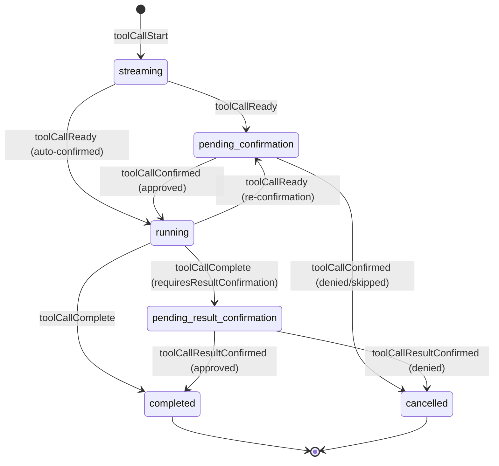

# State Model

All state in AHP is identified by URIs. Clients subscribe to a URI to receive its current state snapshot and subsequent action updates. This is the single universal mechanism for state synchronization.

## Root State

Subscribable at `agenthost:/root`. Contains global, lightweight data that all clients need. **Does not contain the session list** — that is fetched imperatively via RPC (see [Commands](/reference/commands)).

```typescript
RootState {
  agents: AgentInfo[]
}
```

Each `AgentInfo` includes the models available for that agent:

```typescript
AgentInfo {
  provider: string         // e.g. 'copilot'
  displayName: string
  description: string
  models: ModelInfo[]
}

ModelInfo {
  id: string
  provider: string
  name: string
  maxContextWindow?: number
  supportsVision?: boolean
  policyState?: 'enabled' | 'disabled' | 'unconfigured'
}
```

Root state is mutated only by server-originated actions (e.g. `root/agentsChanged`).

## Session State

Subscribable at the session's URI (e.g. `copilot:/<uuid>`). Contains the full state for a single session.

```typescript
SessionState {
  summary: SessionSummary
  lifecycle: 'creating' | 'ready' | 'creationFailed'
  creationError?: ErrorInfo
  workingDirectory?: URI
  turns: Turn[]
  activeTurn: ActiveTurn | undefined
}
```

### Lifecycle

The `lifecycle` field tracks the asynchronous creation process. When a client creates a session, it picks a URI, sends the command, and subscribes immediately. The initial snapshot has `lifecycle: 'creating'`. The server asynchronously initializes the backend and dispatches `session/ready` or `session/creationFailed`.

### Session Summary

Lightweight metadata used in the session list and embedded within session state:

```typescript
SessionSummary {
  resource: URI
  provider: string
  title: string
  status: 'idle' | 'in-progress' | 'error'
  createdAt: number
  modifiedAt: number
  model?: string
  workingDirectory?: URI
}
```

## Turns

A turn represents one request/response cycle between user and agent.

### Completed Turn

```typescript
Turn {
  id: string
  userMessage: UserMessage
  responseParts: ResponsePart[]     // all content in stream order
  usage: UsageInfo | undefined
  state: 'complete' | 'cancelled' | 'error'
  error?: ErrorInfo
}
```

### Active Turn

An in-progress turn where the assistant is actively streaming:

```typescript
ActiveTurn {
  id: string
  userMessage: UserMessage
  responseParts: ResponsePart[]     // all content in stream order
  usage: UsageInfo | undefined
}
```

### User Messages

```typescript
UserMessage {
  text: string
  attachments?: MessageAttachment[]
}

MessageAttachment {
  type: 'file' | 'directory' | 'selection'
  path: string
  displayName?: string
}
```

## Response Parts

All response content — text, tool calls, reasoning, and content references — lives in a single `responseParts` array in stream order. This mirrors how LLM APIs (e.g. OpenAI) represent responses as a unified list of typed items.

```typescript
// Inline markdown content
MarkdownResponsePart {
  kind: 'markdown'
  id: string               // targeted by session/delta for text appends
  content: string
}

// Reasoning/thinking content from the model
ReasoningResponsePart {
  kind: 'reasoning'
  id: string               // targeted by session/reasoning for text appends
  content: string
}

// Tool call (see Tool Call Lifecycle below)
ToolCallResponsePart {
  kind: 'toolCall'
  toolCall: ToolCallState   // full lifecycle state
}

// Reference to large content stored outside the state tree
ContentRef {
  kind: 'contentRef'
  uri: string              // scheme://sessionId/contentId
  sizeHint?: number
  mimeType?: string
}
```

Text content uses a **create-then-append** pattern: the server first emits a `session/responsePart` action to create a new markdown (or reasoning) part with an `id`, then streams text into it via `session/delta` (or `session/reasoning`) actions targeting that `partId`. This pattern is extensible to future streaming content types.

Clients fetch `ContentRef` content separately via the `fetchContent(uri)` command. This keeps the state tree small and serializable.

Consumers can derive display text by concatenating all `markdown` parts, find tool calls by filtering for `toolCall` parts, and access reasoning by filtering for `reasoning` parts.

## Tool Call Lifecycle

Tool calls are represented as a discriminated union on `status`, where each state only exposes the fields valid for that phase.



### States

| Status | Key Fields | Description |
|---|---|---|
| `streaming` | `partialInput?` | LM is streaming tool call parameters. `partialInput` accumulates via `toolCallDelta`. |
| `pending-confirmation` | `invocationMessage`, `toolInput?` | Parameters complete or mid-execution confirmation needed. Uses `_meta` for context (e.g. permission kind, command text). |
| `running` | `confirmed` | Tool is executing. `confirmed` records how it was approved. |
| `pending-result-confirmation` | `success`, `pastTenseMessage`, `content?` | Execution finished, waiting for client to approve the result. |
| `completed` | `success`, `pastTenseMessage`, `content?` | Terminal state. Tool finished. |
| `cancelled` | `reason`, `reasonMessage?`, `userSuggestion?` | Terminal state. `reason` is `'denied'`, `'skipped'`, or `'result-denied'`. |

### Mid-execution Re-confirmation

When a running tool needs additional user approval (e.g. a shell permission), the server dispatches `session/toolCallReady` again without `confirmed`. This transitions the tool call from `running` back to `pending-confirmation`, updating `invocationMessage` and `_meta` with context about what needs approval. The client uses the standard `session/toolCallConfirmed` flow to approve or deny.

When a turn completes, non-terminal tool calls in `responseParts` are force-cancelled with reason `'skipped'`.

## Usage Info

Token usage reported per turn:

```typescript
UsageInfo {
  inputTokens?: number
  outputTokens?: number
  model?: string
  cacheReadTokens?: number
}
```

## Session List

The session list can be arbitrarily large and is **not** part of the state tree. Instead:

- Clients fetch the list imperatively via `listSessions()` RPC.
- The server sends lightweight **notifications** (`sessionAdded`, `sessionRemoved`) so connected clients can update a local cache without re-fetching.

Notifications are ephemeral — not processed by reducers, not stored in state, not replayed on reconnect. On reconnect, clients re-fetch the list.

## Next Steps

- [Actions](/guide/actions) — How state is mutated.
- [Write-Ahead Reconciliation](/guide/reconciliation) — How clients stay in sync.
- [State Types Reference](/reference/state-types) — Complete type definitions.
