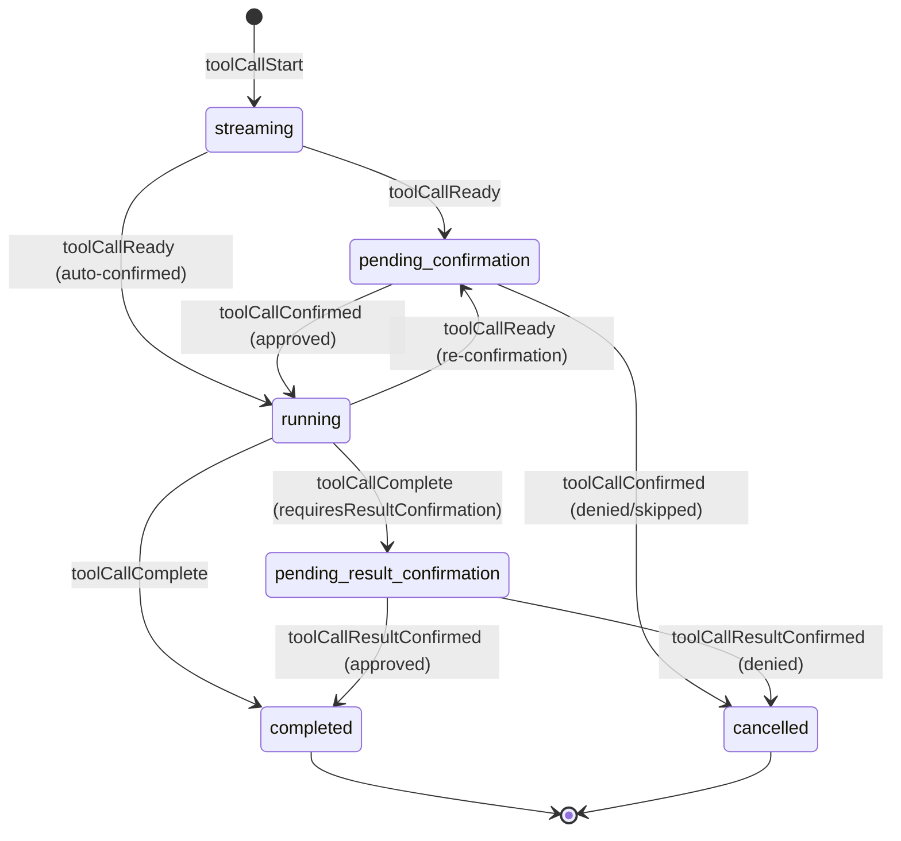
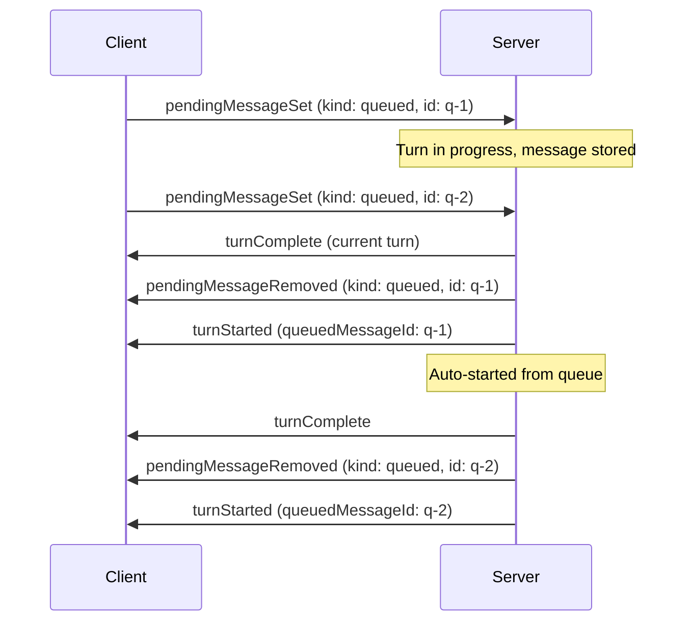
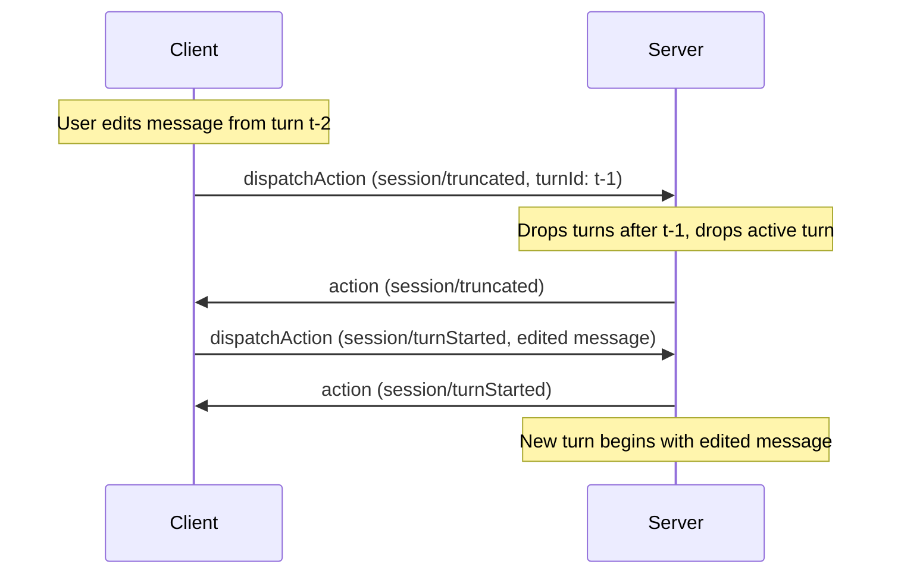

# State Model

All state in AHP is identified by URIs. Clients subscribe to a URI to receive its current state snapshot and subsequent action updates. This is the single universal mechanism for state synchronization.

## Root State

Subscribable at `agenthost:/root`. Contains global, lightweight data that all clients need. **Does not contain the full session list** — that is fetched imperatively via RPC (see [Commands](/reference/commands)). Root state MAY carry a small "hot" subset of session summaries in `loadedSessions` for live sync (see [Loaded Sessions](#loaded-sessions) below).

```typescript
RootState {
  agents: AgentInfo[]
  loadedSessions?: SessionSummary[]
}
```

Each `AgentInfo` includes the models available for that agent:

```typescript
AgentInfo {
  provider: string         // e.g. 'copilot'
  displayName: string
  description: string
  models: ModelInfo[]
  customizations?: CustomizationRef[]  // Open Plugins
}

ModelInfo {
  id: string
  provider: string
  name: string
  maxContextWindow?: number
  supportsVision?: boolean
  policyState?: 'enabled' | 'disabled' | 'unconfigured'
}
```

Root state is mutated only by server-originated actions (e.g. `root/agentsChanged`).

## Session State

Subscribable at the session's URI (e.g. `copilot:/<uuid>`). Contains the full state for a single session.

```typescript
SessionState {
  summary: SessionSummary
  lifecycle: 'creating' | 'ready' | 'creationFailed'
  creationError?: ErrorInfo
  workingDirectory?: URI
  turns: Turn[]
  activeTurn: ActiveTurn | undefined
  inputRequests?: SessionInputRequest[]
  customizations?: SessionCustomization[]  // server-provided plugins
}
```

### Lifecycle

The `lifecycle` field tracks the asynchronous creation process. When a client creates a session, it picks a URI, sends the command, and subscribes immediately. The initial snapshot has `lifecycle: 'creating'`. The server asynchronously initializes the backend and dispatches `session/ready` or `session/creationFailed`.

### Session Summary

Lightweight metadata used in the session list and embedded within session state:

```typescript
SessionSummary {
  resource: URI
  provider: string
  title: string
  status: number  // SessionStatus bitset
  createdAt: number
  modifiedAt: number
  model?: string
  workingDirectory?: URI
  isRead?: boolean
  isDone?: boolean
}
```

The optional `isRead` flag indicates whether the client has viewed the session since its last modification. The optional `isDone` flag indicates whether the session has been marked as complete by the client. Both are managed via client-dispatched actions (`session/isReadChanged`, `session/isDoneChanged`).

### Session Status Bitset

`summary.status` is a numeric bitset. Clients SHOULD use bitwise checks instead of string or equality checks for activity states:

| Name | Value | Bits | Meaning |
|---|---:|---|---|
| `SessionStatus.Idle` | `1` | `1 << 0` | No active turn and no pending input request. |
| `SessionStatus.Error` | `2` | `1 << 1` | The most recent turn ended with an error. |
| `SessionStatus.InProgress` | `8` | `1 << 3` | A turn is active. |
| `SessionStatus.InputNeeded` | `24` | `(1 << 3) \| (1 << 4)` | A turn is active and either at least one user input request is open, or at least one tool call is awaiting user confirmation (pre- or post-execution). Includes the `InProgress` bit. |

For example, `(status & SessionStatus.InProgress) !== 0` is true for both `InProgress` and `InputNeeded`.

## Turns

A turn represents one request/response cycle between user and agent.

### Completed Turn

```typescript
Turn {
  id: string
  userMessage: UserMessage
  responseParts: ResponsePart[]     // all content in stream order
  usage: UsageInfo | undefined
  state: 'complete' | 'cancelled' | 'error'
  error?: ErrorInfo
}
```

### Active Turn

An in-progress turn where the assistant is actively streaming:

```typescript
ActiveTurn {
  id: string
  userMessage: UserMessage
  responseParts: ResponsePart[]     // all content in stream order
  usage: UsageInfo | undefined
}
```

### User Messages

```typescript
UserMessage {
  text: string
  attachments?: MessageAttachment[]
}

MessageAttachment {
  type: 'file' | 'directory' | 'selection'
  path: string
  displayName?: string
}
```

## Response Parts

All response content — text, tool calls, reasoning, and content references — lives in a single `responseParts` array in stream order. This mirrors how LLM APIs (e.g. OpenAI) represent responses as a unified list of typed items.

```typescript
// Inline markdown content
MarkdownResponsePart {
  kind: 'markdown'
  id: string               // targeted by session/delta for text appends
  content: string
}

// Reasoning/thinking content from the model
ReasoningResponsePart {
  kind: 'reasoning'
  id: string               // targeted by session/reasoning for text appends
  content: string
}

// Tool call (see Tool Call Lifecycle below)
ToolCallResponsePart {
  kind: 'toolCall'
  toolCall: ToolCallState   // full lifecycle state
}

// Reference to large content stored outside the state tree
ContentRef {
  kind: 'contentRef'
  uri: string              // scheme://sessionId/contentId
  sizeHint?: number
  mimeType?: string
}
```

Text content uses a **create-then-append** pattern: the server first emits a `session/responsePart` action to create a new markdown (or reasoning) part with an `id`, then streams text into it via `session/delta` (or `session/reasoning`) actions targeting that `partId`. This pattern is extensible to future streaming content types.

Clients fetch `ContentRef` content separately via the `resourceRead(uri)` command. This keeps the state tree small and serializable.

Consumers can derive display text by concatenating all `markdown` parts, find tool calls by filtering for `toolCall` parts, and access reasoning by filtering for `reasoning` parts.

## Tool Call Lifecycle

Tool calls are represented as a discriminated union on `status`, where each state only exposes the fields valid for that phase.



### States

| Status | Key Fields | Description |
|---|---|---|
| `streaming` | `partialInput?` | LM is streaming tool call parameters. `partialInput` accumulates via `toolCallDelta`. |
| `pending-confirmation` | `invocationMessage`, `toolInput?` | Parameters complete or mid-execution confirmation needed. Uses `_meta` for context (e.g. permission kind, command text). |
| `running` | `confirmed` | Tool is executing. `confirmed` records how it was approved. |
| `pending-result-confirmation` | `success`, `pastTenseMessage`, `content?` | Execution finished, waiting for client to approve the result. |
| `completed` | `success`, `pastTenseMessage`, `content?` | Terminal state. Tool finished. |
| `cancelled` | `reason`, `reasonMessage?`, `userSuggestion?` | Terminal state. `reason` is `'denied'`, `'skipped'`, or `'result-denied'`. |

### Mid-execution Re-confirmation

When a running tool needs additional user approval (e.g. a shell permission), the server dispatches `session/toolCallReady` again without `confirmed`. This transitions the tool call from `running` back to `pending-confirmation`, updating `invocationMessage` and `_meta` with context about what needs approval. The client uses the standard `session/toolCallConfirmed` flow to approve or deny.

When a turn completes, non-terminal tool calls in `responseParts` are force-cancelled with reason `'skipped'`.

## Session Input Requests

Sessions can request structured input from the user by storing live requests in top-level session state:

```typescript
SessionState {
  // ...existing fields...
  inputRequests?: SessionInputRequest[]
}

SessionInputRequest {
  id: string
  message: string
  url?: URI
  questions?: SessionInputQuestion[]
  answers?: Record<string, SessionInputAnswer>
}
```

See [Elicitation](/guide/elicitation) for the request lifecycle, question and answer shapes, URL requests, multi-client draft synchronization, and validation rules.

## Usage Info

Token usage reported per turn:

```typescript
UsageInfo {
  inputTokens?: number
  outputTokens?: number
  model?: string
  cacheReadTokens?: number
}
```

## Session List

The session list can be arbitrarily large and is **not** part of the state tree. Instead:

- Clients fetch the list imperatively via `listSessions()` RPC.
- The server sends lightweight **notifications** (`sessionAdded`, `sessionRemoved`) so connected clients can update a local cache without re-fetching.

Notifications are ephemeral — not processed by reducers, not stored in state, not replayed on reconnect. On reconnect, clients re-fetch the list.

## Loaded Sessions

`loadedSessions` on root state is a small "hot" subset of session summaries that the server is actively live-syncing on the root subscription. Clients that are displaying a session list or sidebar can subscribe to `agenthost:/root` and receive summary updates (title, status, diffs, `isRead`, `isDone`, `modifiedAt`, …) for this subset without having to subscribe to each session URI individually.

```typescript
RootState {
  // ...
  loadedSessions?: SessionSummary[]
}
```

### Relationship to the session list

`loadedSessions` is **complementary** to — not a replacement for — the existing session-list mechanisms:

| Mechanism | Purpose | Delivery |
|---|---|---|
| `listSessions()` | Fetch the full catalog of sessions (may be arbitrarily large). | Imperative RPC. |
| `notify/sessionAdded` / `notify/sessionRemoved` | Signal session creation/disposal so clients can update a local cache. | Ephemeral notifications (not replayed). |
| `loadedSessions` + `root/loadedSession*` actions | Live summary updates for a tracked subset. | Part of the root state tree; replayed on reconnect via the standard subscription machinery. |

A client that wants up-to-date summaries without subscribing to every session SHOULD:

1. Fetch the catalog once via `listSessions()`.
2. Subscribe to `agenthost:/root` and maintain its cache from `loadedSessions` whenever an entry exists.
3. Listen to `notify/sessionAdded` / `notify/sessionRemoved` for lifecycle changes.

### Action semantics

The server drives `loadedSessions` with two actions:

- `root/loadedSessionChanged` — Upserts a session summary into `loadedSessions`, keyed by `summary.resource`. Used both to start tracking a session and to push subsequent summary updates for an already loaded session.
- `root/loadedSessionRemoved` — Removes the entry for `session` from `loadedSessions`. This does **not** imply the session was disposed; session disposal is signaled by `notify/sessionRemoved`. The field collapses to `undefined` when the last entry is removed.

Both actions are server-originated. Which sessions the server chooses to load is a server policy (for example, a server may auto-track recently active sessions).

## Pending Messages

Sessions maintain two optional arrays of **pending messages** — instructions queued for future delivery to the agent:

```typescript
SessionState {
  // ...existing fields...
  steeringMessage?: PendingMessage      // inject into current turn
  queuedMessages?: PendingMessage[]     // start as new turns
}

PendingMessage {
  id: string
  userMessage: UserMessage
}
```

### Steering Message

The steering message is injected into the **current turn** at a convenient point. Clients set a steering message to guide the agent mid-flight — for example, telling it to focus on a specific file or change approach. Only one steering message exists at a time; adding a new one replaces any existing one.

- When the session has an active turn, the server consumes the steering message at its discretion, dispatching `session/pendingMessageRemoved` when it does.
- When set while idle, the steering message is silently stored until a turn starts.

### Queued Messages

Queued messages are automatically started as **new turns** after the current turn finishes. The server processes them FIFO (by arrival order).

- When a turn completes and queued messages exist, the server removes the first queued message and starts a new turn from it.
- When a queued message is added while the session is idle, the server SHOULD immediately consume it and start a turn.
- The resulting `session/turnStarted` action includes a `queuedMessageId` field linking back to the source queued message.



### Management

Clients can **set** or **remove** both steering and queued messages at any time using the `session/pendingMessageSet` (upsert) and `session/pendingMessageRemoved` actions with a `kind` discriminant (`'steering'` or `'queued'`).

## Session Truncation

The `session/truncated` action removes turn history from a session. It is **client-dispatchable** — either side can truncate. If the session has an active turn it is silently dropped and the session status returns to `idle`.

- **With `turnId`** — keeps all turns up to and including the specified turn; removes everything after it.
- **Without `turnId`** — removes all turns (empties the session).

A common pattern is to truncate and then immediately start a new turn with an edited message:



If the `turnId` is not found in the completed turns array, the action is a no-op.

## Session Forking

A new session can be created as a **fork** of an existing session by providing the optional `fork` field in `createSession`. The server populates the new session with content from the source session up to and including the response of the specified turn.

```typescript
createSession({
  session: 'copilot:/<new-uuid>',
  provider: 'copilot',
  fork: {
    session: 'copilot:/<source-uuid>',
    turnId: 't-3',     // copy turns through t-3
  },
})
```

The forked session is an independent copy — subsequent changes to either session do not affect the other. The server broadcasts `notify/sessionAdded` for the new session as usual.

## Next Steps

- [Actions](/guide/actions) — How state is mutated.
- [Elicitation](/guide/elicitation) — How sessions request user input.
- [Customizations](/guide/customizations) — Extending sessions with Open Plugins.
- [Write-Ahead Reconciliation](/guide/reconciliation) — How clients stay in sync.
- [State Types Reference](/reference/state-types) — Complete type definitions.
