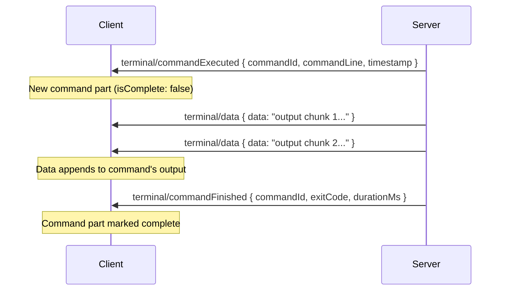
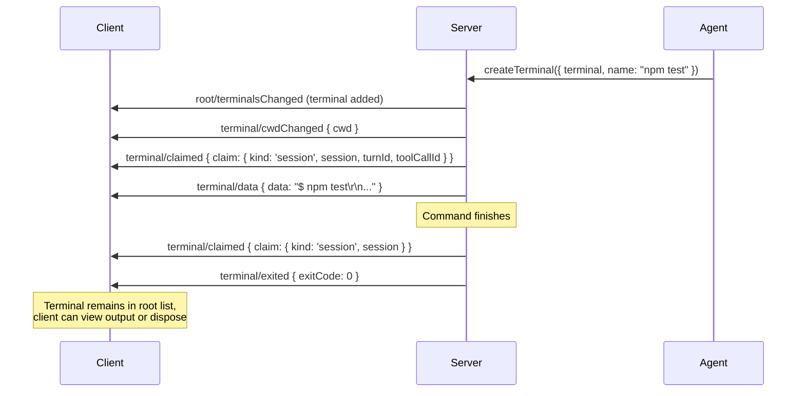
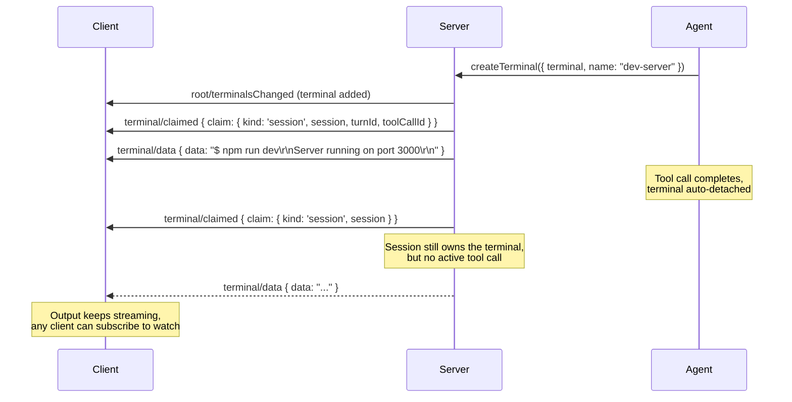
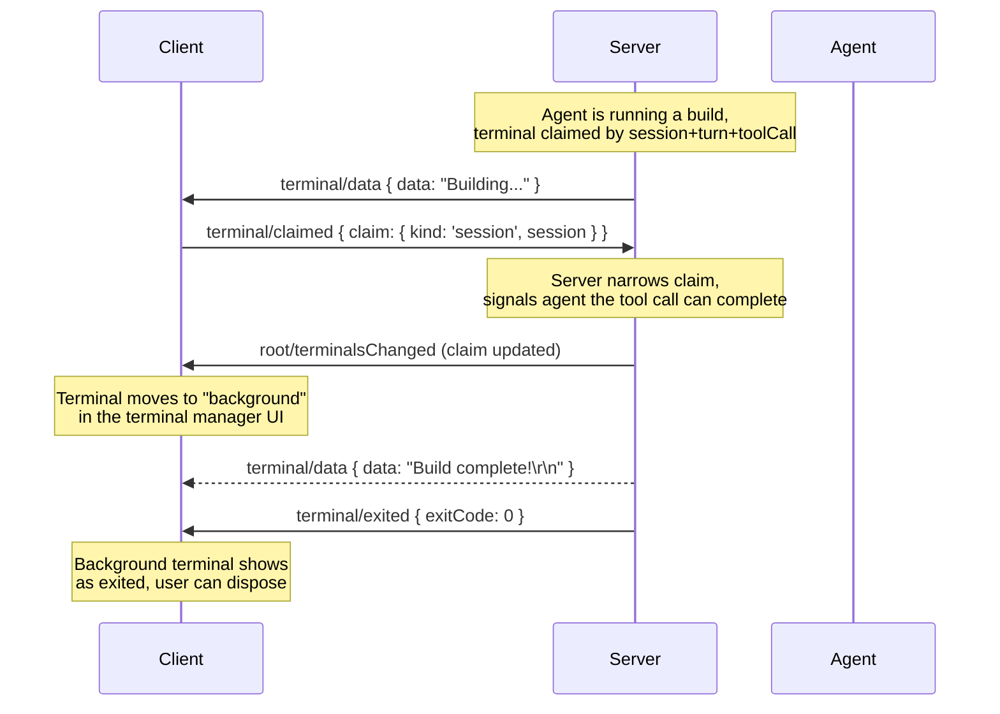
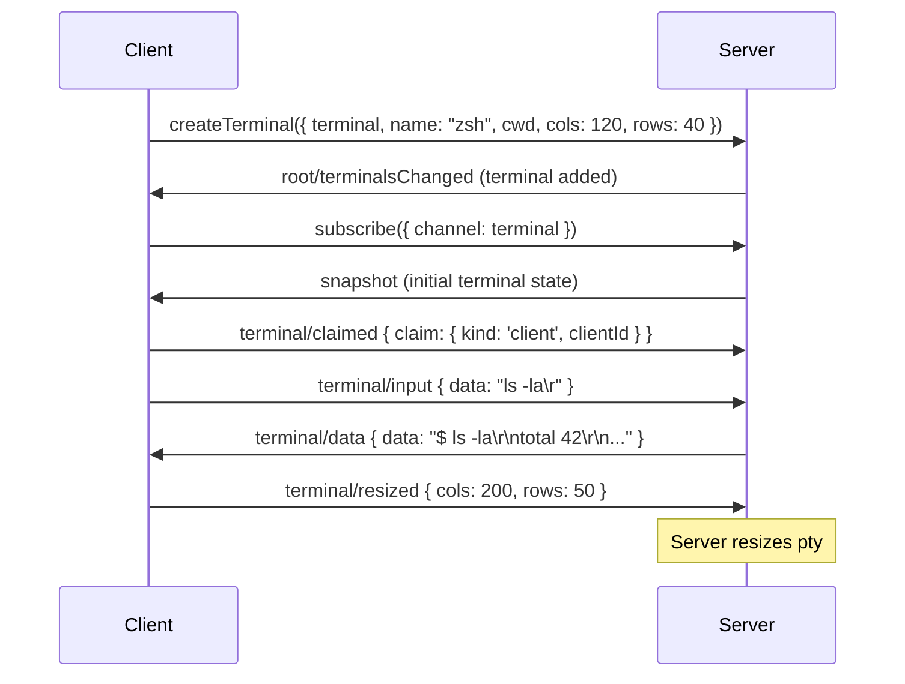
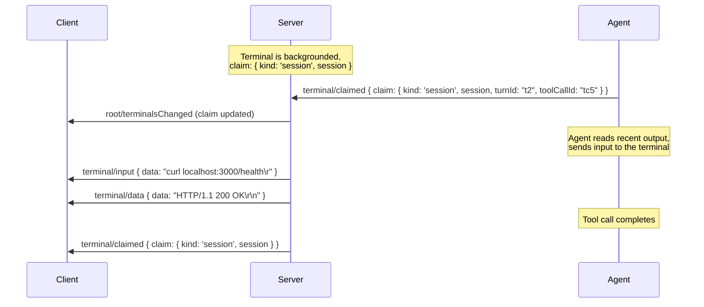
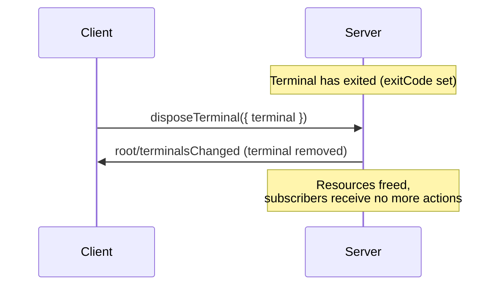

# Terminals

Terminals are a first-class subscribable resource in AHP, living alongside sessions in the root state. They model pseudo-terminal (pty) processes — shell sessions, dev servers, build tasks — that agents and clients can create, interact with, and manage independently of any single session.

## Key Design Points

- **Terminals have their own URIs** and are individually subscribable, just like sessions.
- **Terminal state is separate from session state.** A terminal persists independently of the session that created it.
- **Ownership is tracked via claims.** A claim records who holds a terminal: a client or a session.
- **Every terminal is always owned.** There are no unowned terminals — `createTerminal` requires an initial claim, and `terminal/claimed` transfers ownership rather than releasing it.

## Terminal State

### Root State

The root state at `ahp-root://` includes a lightweight terminal listing:

```typescript
RootState {
  agents: AgentInfo[]
  activeSessions?: number
  terminals?: TerminalInfo[]
}
```

Each `TerminalInfo` carries enough metadata to render a terminal manager UI without subscribing to each terminal individually:

```typescript
TerminalInfo {
  resource: URI             // subscribable terminal URI
  title: string             // human-readable name
  claim: TerminalClaim      // who holds it
  exitCode?: number         // present = process exited
}
```

### Full Terminal State

Subscribing to a terminal URI provides the complete state:

```typescript
TerminalState {
  title: string
  cwd?: URI                 // current working directory
  cols?: number             // width in columns
  rows?: number             // height in rows
  content: TerminalContentPart[]  // structured content parts
  exitCode?: number         // set when process exits
  claim: TerminalClaim      // ownership
  supportsCommandDetection?: boolean  // true when command lifecycle actions are emitted
}
```

The `content` field is an ordered array of typed content parts. Each part is either unstructured terminal output or a structured command with its command line and output:

```typescript
// Raw terminal output (prompts, gaps between commands, etc.)
TerminalUnclassifiedPart {
  type: 'unclassified'
  value: string             // accumulated VT output
}

// A command with its lifecycle metadata
TerminalCommandPart {
  type: 'command'
  commandId: string         // correlates with commandExecuted/commandFinished actions
  commandLine: string       // the command text submitted to the shell
  output: string            // accumulated VT output from the command
  timestamp: number         // Unix ms when execution started (server clock)
  isComplete: boolean       // false while executing, true after commandFinished
  exitCode?: number         // set at completion
  durationMs?: number       // wall-clock duration, set at completion
}
```

Naive consumers that only need the raw VT stream can reconstruct it with:
```typescript
content.map(p => p.type === 'command' ? p.output : p.value).join('')
```

Scrollback length is implementation-defined — the server controls how much history to retain. Both sides MAY independently trim their `content` to bound memory.

::: info Server-Side Metadata
The agent host MAY maintain internal metadata about a terminal's provenance — for example, knowing that a particular terminal was started as a dev server, or tracking the original command that launched it. This metadata is not part of the terminal state exposed to clients, but the server MAY expose it to the model to give the agent richer context when reasoning about terminals.
:::

## Claims and Ownership

Terminal claims answer "who is using this terminal?" using a discriminated union:

```typescript
// A client (e.g. VS Code) interacting directly
TerminalClientClaim {
  kind: 'client'
  clientId: string
}

// A session (e.g. during a tool call)
TerminalSessionClaim {
  kind: 'session'
  session: URI
  turnId?: string           // present when actively used by a tool call
  toolCallId?: string
}
```

The `turnId` and `toolCallId` fields on session claims distinguish between "actively in use by a tool call" and "owned but backgrounded":

| Claim State | Meaning |
|---|---|
| `{ kind: 'session', session, turnId, toolCallId }` | Actively used by a running tool call |
| `{ kind: 'session', session }` | Backgrounded, still owned by the session |
| `{ kind: 'client', clientId }` | User interacting directly in a terminal UI |

Every terminal always has an owner. When a terminal is no longer needed, it should be disposed via the `disposeTerminal` command rather than released.

## Terminal Actions

All terminal actions carry a `terminal: URI` field identifying the target terminal.

### Data Flow

| Action | Client-dispatchable | Reducer Effect |
|---|:---:|---|
| `terminal/data` | No | Appends to tail content part |
| `terminal/input` | Yes | No-op (server forwards to pty) |

`terminal/data` is **server-only**: the server dispatches it for pty output flowing to clients.

When `terminal/data` arrives, the reducer appends the data to the last content part:
- If the tail is an incomplete `command` part, data is appended to its `output`.
- If the tail is an `unclassified` part, data is appended to its `value`.
- Otherwise, a new `unclassified` part is created.

`terminal/input` is a **client-only, side-effect-only action**: the client dispatches keyboard input, the server forwards it to the pty process. The reducer does not modify state — any resulting output arrives later via `terminal/data`.

::: tip Why two separate actions?
Terminal I/O is intentionally split into `terminal/input` (client → pty) and `terminal/data` (pty → client) because **standard write-ahead reconciliation is not safe for terminals**. A pty is a stateful, mutable process — optimistically applying input or predicting output would produce incorrect state. By keeping input as a side-effect-only action and output as server-authoritative, clients avoid the reconciliation pitfalls that would arise from treating terminal I/O like normal state actions.
:::

### Command Detection

Terminals that support **shell integration** can report command boundaries, enabling clients to show per-command status decorations, auto-expand/collapse output, and persist command snapshots.

| Action | Client-dispatchable | Reducer Effect |
|---|:---:|---|
| `terminal/commandExecuted` | No | Appends `command` part, sets `supportsCommandDetection` |
| `terminal/commandFinished` | No | Marks matching `command` part as complete |

The lifecycle of a single command:



The server MUST NOT include shell integration escape sequences in `terminal/data` actions — these must be stripped before dispatch. Failure to strip them causes false positives in "has real output" checks on the client.

Clients MUST check `supportsCommandDetection` before relying on command boundaries. When absent, all data flows into `unclassified` parts and no command lifecycle is available.

### Control

| Action | Client-dispatchable | Reducer Effect |
|---|:---:|---|
| `terminal/resized` | Yes | Sets `cols`, `rows` |
| `terminal/claimed` | Yes | Sets `claim` |
| `terminal/titleChanged` | Yes | Sets `title` |
| `terminal/cwdChanged` | No | Sets `cwd` |
| `terminal/exited` | No | Sets `exitCode` |
| `terminal/cleared` | Yes | Resets `content` to `[]` |

The root terminal list is managed by the server via `root/terminalsChanged`, which uses full-replacement semantics.

## Commands

| Command | Direction | Description |
|---|---|---|
| `createTerminal` | Client → Server | Creates a new terminal with a required initial claim, optional name, cwd, and dimensions |
| `disposeTerminal` | Client → Server | Kills the process (if running) and removes the terminal |

After creating a terminal, the client should subscribe to its URI to receive state updates. The server dispatches `root/terminalsChanged` to add the terminal to the root listing.

## Flows

### Agent Runs a Command

The most common flow: an agent tool call creates a terminal, runs a command, and returns the result.



### Agent Starts a Background Server

An agent starts a long-running process (e.g. dev server) and detaches from it, keeping session ownership for cleanup.



The critical detail: the claim narrows from `{ session, turnId, toolCallId }` to `{ session }`. The terminal is now "background" but still associated with the session.

If the session is later disposed, the server can clean up all terminals still claimed by it.

### Client Detaches a Terminal

A user watching an agent run a long task decides to detach it so the agent can move on, but the terminal continues in the background.



### Client Interacts Directly

A user opens a terminal in the client UI for interactive shell usage.



### Session Reclaims a Background Terminal

An agent re-engages with a terminal it previously backgrounded (e.g. to check a dev server's output or restart it).



### Terminal Cleanup

Disposing terminals when they're no longer needed.



The server may also dispose terminals automatically — for example, when a session that owns terminals is disposed.

## Multi-Client Scenarios

Because terminals are root-scoped and independently subscribable, multiple clients naturally see the same terminal state:

- **Client A** creates a terminal and interacts with it
- **Client B** subscribes to the same terminal URI and sees real-time output
- **An agent** claims the terminal for a tool call — both clients see the claim change
- **The agent** releases the claim — both clients see the terminal go to background

The standard [write-ahead reconciliation](/guide/reconciliation) mechanism handles conflicting claims: if two clients try to claim the same terminal simultaneously, the server accepts one and rejects the other with a `rejectionReason` in the action envelope.
