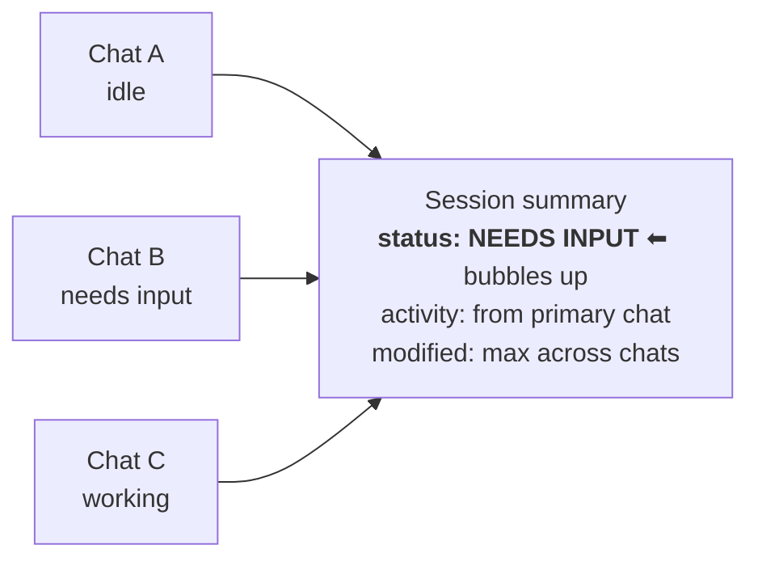
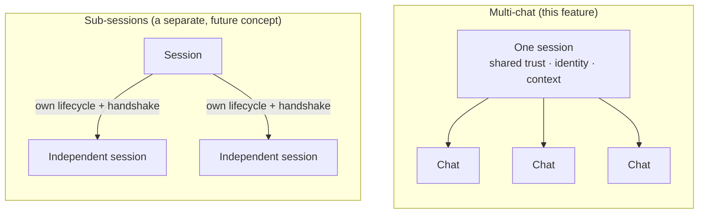
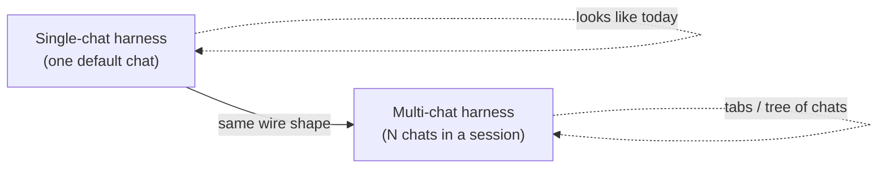
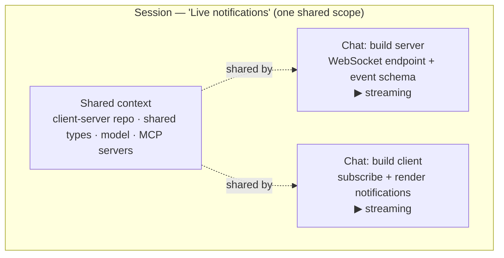
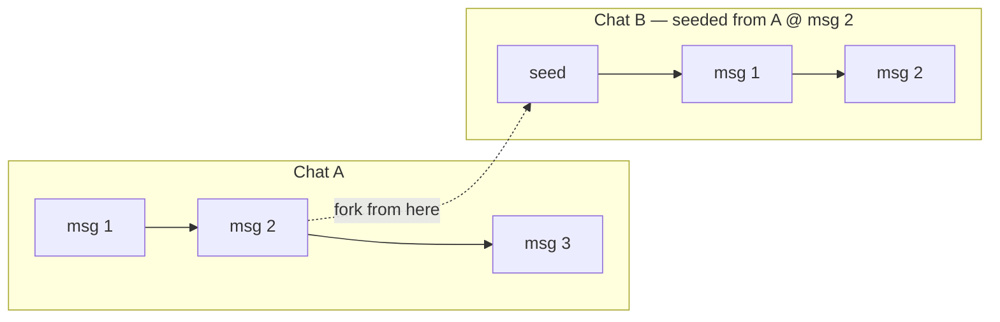
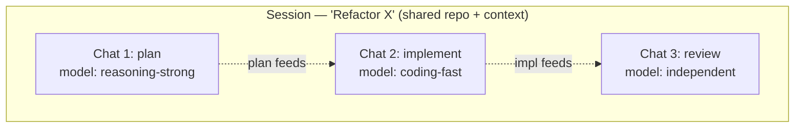
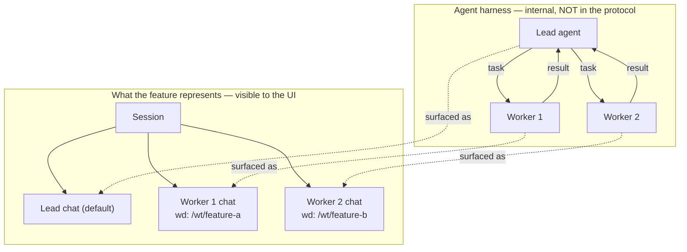
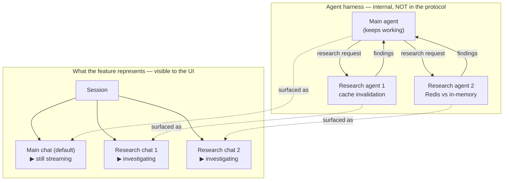
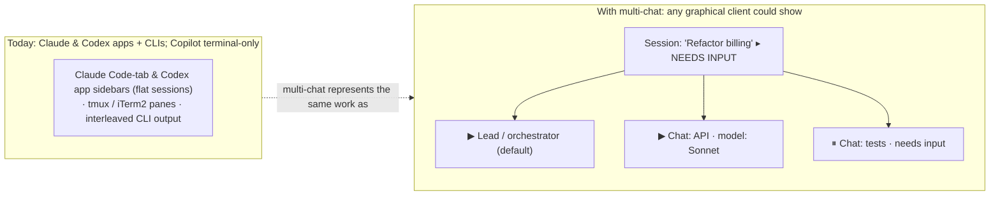

# Multiple Chats in a Session — Feature Overview

> A conceptual walkthrough of the multi-chat feature for presentations and
> design discussion. This document deliberately stays at the *feature* level —
> it explains **what** the capability is and **why** it exists, without going
> into the protocol's concrete actions, state shapes, or wire format.

---

## 1. The problem

An agent session today is **a single, linear conversation**. The session *is*
the chat: one stream of messages, tool calls, and results between a user and an
agent.

That model is increasingly at odds with where agent products are heading.
Modern harnesses run **more than one agent at a time**:

- A lead agent that breaks a feature into subtasks and farms them out to workers.
- A "team" of specialised agents (a reviewer, a test-writer, an implementer)
  working in parallel.
- A swarm of workers, each operating in its own checkout of the repository.

When a single session can only ever be one conversation, a user interface has no
honest way to *show* this. The work either gets flattened into one noisy
transcript, or it gets split across unrelated sessions that lose their shared
context (the same workspace, the same project, the same configuration).

**The feature in one sentence:** let a single session contain *multiple
concurrent chats* that share one context, so that multi-agent work can be
represented, observed, and interacted with as a coherent whole.

---

## 2. The mental model

The shift is to stop treating "session" and "conversation" as the same thing,
and split them into two roles:

- **A session is a coordination *scope*.** It owns everything that is shared:
  the workspace, the project, the default model and agent, configuration, and
  any customizations. It is the boundary of trust and identity — everything
  inside a session is "the same actor working on the same thing."

- **A chat is a conversation *stream* over that scope.** Each chat is an
  independently-followable thread of messages and activity. Chats are created
  and removed over the lifetime of the session, and each one can be watched on
  its own.

> Scope vs. stream is the whole idea. One scope, many streams.

A helpful analogy: a session is a **project workspace**, and chats are the
**individual work threads** happening inside it. Closing one thread doesn't tear
down the workspace; the workspace is what gives every thread its shared ground.

---

## 3. Where this feature lives in the stack

This is the single most important framing for a reviewer or an audience, because
it answers the obvious follow-up question ("where do the agents talk to each
other?") before it's asked.

```
   ┌─────────────┐                         ┌──────────────────────────────┐
   │  UI client  │   ◄── feature layer ──► │   Agent harness              │
   │ (the app a  │    sessions, chats,     │   ── lead agent              │
   │  user sees) │    activity, status     │   ── worker agents   ◄───┐   │
   └─────────────┘                         │   ── task routing /      │   │
                                           │      results (internal) ─┘   │
                                           └──────────────────────────────┘
```

There are two distinct layers, and this feature only touches one of them:

- **The harness layer** is where the *agents actually run*. Spawning a worker,
  giving it a task, routing a message to it, and collecting its result are all
  things the harness does inside its own runtime.

- **The feature/interoperability layer** (where this feature lives) is the
  **window** onto that work. Its job is to let a user interface *represent and
  interact with* what the harness is doing — to show the chats, stream their
  activity, and surface their combined status.

**The feature is about observability and interaction, not agent runtime.** It
makes multi-agent work *visible and usable*; it does not dictate how agents
coordinate internally.

---

## 4. What the feature gives you

At the feature level, multi-chat introduces a small number of capabilities:

1. **A catalog of chats per session.** A session exposes the set of chats it
   currently contains. Chats can be added and removed as work spins up and winds
   down, and each chat carries a lightweight summary (title, current status,
   most recent activity).

2. **A default chat.** One chat is designated the "primary" thread — the natural
   place a user lands, and the fallback the session points at when nothing more
   specific applies.

3. **Independent, subscribable streams.** Each chat can be followed on its own:
   its messages, its tool calls, its progress. Watching one chat doesn't require
   pulling in the noise of the others.

4. **Per-chat working directory.** Each chat may pin to its own working
   directory. By default a chat inherits the session's, but a chat can override
   it — which is exactly what a swarm of workers in separate worktrees needs.

5. **An aggregated session view.** The session presents a roll-up of its chats:
   a combined status (e.g. "needs input" bubbles up if *any* chat is blocked),
   an overall activity, and a most-recently-modified timestamp. This lets a UI
   show a single, honest summary chip for the whole session.



---

## 5. Worked example: an agent team

Consider a harness that runs a "team": a lead agent plus a couple of workers,
each in its own checkout of the repository.

| What the harness does | How the feature represents it |
| --- | --- |
| Lead agent starts | A session with one default chat (the lead). |
| Lead spins up two workers | Two new chats appear in the session's catalog. |
| Each worker takes its own worktree | Each worker chat pins its own working directory. |
| Workers stream progress | Each chat streams its own activity, watchable on its own. |
| A worker gets stuck and needs input | The session summary rolls up to "needs input." |
| A worker finishes and is torn down | Its chat is removed from the catalog. |

Crucially, **the team's internal coordination never crosses this layer.** The
lead telling a worker what to do, and the worker returning its result, are the
harness's own business. The feature's job is only to make the team *appear* as a
set of chats a user can watch and step into.

This is why you can support a full agent-team experience **without any
chat-to-chat communication in the protocol itself**: the communication already
happens, one layer down, inside the harness.

---

## 6. What this feature deliberately is *not*

Drawing the boundary is as important as the feature itself.

- **It is not chat-to-chat messaging.** There is no primitive for one chat to
  send a message to, or read the stream of, another chat. Chats are independent
  streams that happen to share a scope. Coordination between agents is a harness
  concern.

- **It does not model agent hierarchies.** The feature has no notion of
  "lead vs. worker," "parent vs. child," or assignments and work items. All
  chats are peers under one session. A harness may *use* them to represent a
  hierarchy, but the feature stays neutral.

- **It is not sub-sessions.** Multi-chat is about *cooperating threads that share
  one trust/identity/context*. Independent agents with their own lifecycle and
  their own handshake are a separate concept entirely.

These omissions are intentional. Richer coordination — work items, operations,
assignments, cross-agent messaging — is a natural *future* axis that can be added
later without breaking this feature. Multi-chat is designed to **compose with**
that future work, not to pre-empt it.

The sub-session distinction is worth a picture, since it's the most common point
of confusion. *Multi-chat* is cooperating threads under **one** identity, trust,
and context. *Sub-sessions* are independent agents that authenticate on their
own and have their own lifecycle — a separate, future concept:



---

## 7. Why this shape

A few principles drove the design:

- **Represent, don't orchestrate.** Stay an observability-and-interaction layer.
  The moment the feature starts routing messages between agents, it stops being a
  neutral window and starts being an agent framework — a much larger commitment.

- **Shared context is the point.** The reason these chats belong together is that
  they share a workspace, a project, and a configuration. That shared scope is
  what a bundle of unrelated sessions could never give you.

- **Small, additive, composable.** Each capability (catalog, default, per-chat
  working directory, aggregated summary) is a small addition that earns its
  place, and leaves room for the bigger coordination story to land later.

- **Graceful degradation.** The feature is backward compatible: a harness that
  only ever runs one conversation exposes exactly **one chat (the default)**, and
  the experience is identical to today. As a harness grows richer multi-agent
  behaviour, it simply lights up *more chats* in the same session — there is
  nothing to opt out of, and nothing breaks.



## 8. Scenarios — and how each harness supports them

Each scenario below pairs a conceptual **diagram and real-world example** (the
*feature* shape, not the wire format — written in Mermaid so they render in
GitHub, VS Code, and most slide tools) with **how each harness supports it
today**.

> **Doc-verified snapshot, still a moving target.** The mappings below were
> checked against each product's official documentation (June 2026) and cite
> their sources, but harness capabilities change quickly and several features are
> experimental. The point is the **pattern** — how each product's parallel-agent
> work maps onto the feature — not a permanent scorecard.

Because the feature degrades gracefully (see §7), no harness ever "breaks" — the
only question is **how many of the scenarios it lights up, and how a UI shows
them.**

Under each scenario, an **"Across harnesses today"** breakdown covers every
harness across **both surfaces — CLI and desktop app** — with a real-time
example and how it presents in the UI. Verified against official docs (checked
June 2026; see [Sources](#sources)). Several features are experimental and
capabilities move fast, so treat this as a current snapshot.

**Surface note up front:** Both **Claude Code** and **Codex** ship a graphical
desktop **app** alongside their CLI, and the two apps are strikingly similar: a
left **sidebar of parallel sessions/threads** grouped by the **repo/folder you
open — not by worktree**. Each session still gets its own worktree, but the
sidebar lists **every session in the repo across all features** as a **flat
list**, so unrelated features are interleaved with no per-feature group (the
CLI's "`cd` into a feature worktree to scope its chats" idiom doesn't carry
over). The apps also offer **per-session Git-worktree isolation**, a **split
view** to see two sessions at once, and arrangeable **diff / preview / terminal /
subagent panes**. **GitHub Copilot CLI** is *terminal-only* for this work (its
graphical surface is the separate, coarser VS Code coding-agent). Neither app,
though, models the parallel work as **one shared session with a rolled-up status
across peers** — they list independent sessions side by side.

### 8.1 User-driven parallel work in one context

The most common everyday case, and it's **driven by the user, not the agent**: a
person deliberately opens several chats over the *same* shared context to push a
piece of work forward. Three things come together here — the chats **share one
scope** (workspace, model, config), they can **stream concurrently**, and they
stay **grouped under one session** in the UI. No agent is spawning anything; the
human is curating the threads.

> **Real-world example:** A developer is working in a `client-server` monorepo
> that holds both the backend service and the frontend client, with the model and
> the project's MCP servers configured once at the session level. To build a new
> "live notifications" feature end-to-end, they open two chats themselves — one to
> *build the server* (add the WebSocket endpoint and event schema), and one to
> *build the client* (subscribe to the socket and render the notifications). Both
> chats see the same checked-out branch, the same shared types, and the same lint
> config (shared context). They have the server chat scaffold the endpoint while
> they simultaneously work the client chat against the agreed event shape
> (concurrent). The next morning they reopen the one session and both threads —
> server and client — are still grouped together (grouped), instead of hunting
> through unrelated histories to reassemble the feature.



**Across harnesses today:**

**Claude Code**
- **CLI:** Supported via *named sessions* over one workspace — `claude -n
  auth-refactor` (or `/rename`), switched through the `/resume` picker (a
  terminal TUI that lists every session per project, with worktree/all-project
  widening via Ctrl+W / Ctrl+A). Caveat: resuming the *same* session in two
  terminals interleaves both transcripts, so genuinely parallel threads need a
  fork (see 8.2) or separate named sessions.
- **Desktop app:** Supported and graphical — the **Code tab** lists your sessions
  in a sidebar and runs several in parallel; for Git repos **each session gets its
  own isolated worktree**, and **Cmd-click** opens two sessions side by side
  (split view). Sessions group by the project folder you open.
- **Real-time example:** A dev opens `claude -n api` in one terminal and
  `claude -n tests` in another over the same repo, curating two independent
  threads side by side.
- **UI:** terminal — the `/resume` session-picker list, or several terminal
  windows / tmux panes. Desktop — the Code-tab sidebar of parallel sessions
  with split view.

**Codex**
- **CLI:** One main thread, but `/new` starts a fresh conversation in the same
  process and `/agent` switches between active threads.
- **Desktop app:** Supported and graphical — the app organizes work by *project*
  and runs multiple threads at once, each **Local** (foreground) or in an
  isolated Git **Worktree**; the sidebar lists threads per project. The cloud
  view at `chatgpt.com/codex` shows queued/active tasks as cards.
- **Real-time example:** In the Codex app a dev opens one project and launches
  three threads — a worktree refactor, a test pass, and a docs update — all
  visible in the sidebar and streaming in parallel.
- **UI:** graphical app sidebar (per-project thread list) + cloud task cards;
  CLI = thread switching via `/agent`.

**GitHub Copilot CLI**
- **CLI:** Partial — you can run `copilot` in several terminal instances over the
  same workspace, and the `/resume` picker switches between saved sessions, but
  only **one at a time** (no live in-session thread switching). `copilot --cloud`
  lists "run multiple tasks in parallel" as a use case.
- **Desktop app:** N/A for the CLI — terminal-only.
- **Real-time example:** A dev runs `copilot` in two terminal tabs in the same
  repo to push two threads forward at once.
- **UI:** terminal — multiple windows, or the `/resume` session picker.

#### How the UI looks

**Claude Code — CLI** (the way a user works a feature in parallel today is to
**create a feature-named git worktree and open a session per piece of
work inside it** — Claude groups sessions by directory, so the worktree *is* the
feature):

```text
 $ git worktree add ../live-notifications   # the feature
 $ cd ../live-notifications
 Terminal A                         │  Terminal B
 $ claude -n build-server           │  $ claude -n build-client
  ● build-server   ▶ streaming      │   ● build-client   ▶ streaming
  > add WebSocket endpoint…         │   > subscribe + render notifs…
 ───────────────── /resume picker ─────────────────
  ▾ ~/code/live-notifications   ← the feature (worktree)
      ├ build-server   ▶ in progress
      └ build-client   ▶ in progress
```

> This is the real, idiomatic flow — the worktree directory is how you name a
> feature and keep its parallel chats together. Its one limit: the grouping is a
> *directory*, not a session object, so there's no rolled-up status/title across
> the chats, and the worktree axis is now spent on grouping (you can't also give
> each chat its *own* worktree — the 8.4 case). AHP keeps the same pattern but
> separates the axes: the **`session`** is the feature (shared scope +
> rolled-up status); **`workingDirectory`** (per session, optionally overridden
> per chat) is the filesystem — so you group *and* can still isolate chats.

**Claude Code — desktop app** (the **Code tab** groups sessions by the
**repo/folder you open — not by worktree**. Each session still gets its *own*
auto-created worktree, but the sidebar lists **every session in the repo across
all features** as one **flat list**, so the CLI's feature-grouping idiom — `cd`
into a feature worktree to scope its chats — doesn't carry over; unrelated
features are interleaved, with no per-feature group and no rolled-up status):

```text
 ┌ Claude — Code tab · repo: myapp ─────────────────┐
 │ Sessions (ALL features in repo) │  build-server   │
 │   ● build-server   ▶ wt#1       │  ▶ streaming…   │
 │   ● build-client   ▶ wt#2       │  ── diff ──     │
 │   ● fix-login-bug  ▶ wt#3       │  + server.ts    │  ← other
 │   ● bump-deps      idle         │                 │     features
 └─────────────────────────────────┴─────────────────┘
   grouped by REPO, not feature · all features mixed · per-session worktrees
```

**Codex — CLI** (same idiom — a feature-named worktree holds the parallel
threads; `/agent` switches between them, `/new` opens another):

```text
 $ git worktree add ../live-notifications && cd ../live-notifications
 codex › /agent
  active threads (in this feature worktree) ───────
  1 ● build-server   ▶ running
  2 ○ build-client   idle
  switch 1–2  ·  /new = another thread in this feature
```

**Codex — desktop app** (same story — the app groups threads by the **repo/folder
you open, not by worktree**. Open the repo and you see **every thread across all
features** in one **flat list**; the worktree is only a per-thread *run* location,
never a grouping node — so there's no per-feature group and no rolled-up status):

```text
 ┌ Codex app · repo: myapp ────────────────────────┐
 │ Threads (ALL features in repo)  │  build-server │
 │   ● build-server   ▶ wt#1       │  ▶ streaming… │
 │   ● build-client   ▶ wt#2       │  [review pane]│
 │   ● fix-login-bug  ▶ wt#3       │               │  ← other
 │   ● bump-deps      idle         │               │     features
 └─────────────────────────────────┴───────────────┘
   grouped by REPO, not feature · all features mixed in one list
```

**GitHub Copilot CLI — CLI** (same idiom — create the feature worktree, then run
a `copilot` per piece of work; `/resume` reopens one at a time):

```text
 $ git worktree add ../live-notifications && cd ../live-notifications
 Terminal 1: $ copilot              Terminal 2: $ copilot
  > build the server endpoint        > build the client subscriber
  ● working…                         ● working…
 (desktop app: N/A — terminal-only)
```

### 8.2 Forking

A new chat is forked from a point in an existing chat, seeded with that history,
then diverges on its own. Both chats keep sharing the session's context.

> **Real-world example:** Mid-debugging, at message 12 the agent proposes two
> fixes for a race condition. Rather than lose the current thread, the developer
> forks a new chat *seeded from message 12* to try approach B (rewrite the path
> around a queue) while the original chat still holds approach A. Both forks
> share the same repo and config; the developer compares the two outcomes and
> keeps the winner.



**Across harnesses today:**

**Claude Code**
- **CLI:** Supported — `/branch [name]` copies the conversation so far and
  switches you into it (original preserved, resumable via `/resume`);
  `claude --continue --fork-session` does the same from the command line; inside
  a `/btw` overlay, `f` forks a new session inheriting the parent transcript plus
  that Q&A. Distinct from rewind/checkpoints (Esc-Esc), which edit the *same*
  thread.
- **Desktop app:** Supported — the Code tab has **side chats** (`Cmd+;`): a side
  question that reuses the session's context without derailing the main thread —
  effectively a lightweight in-app fork. A **full fork lands as a flat sibling**
  session in the repo list (in its own worktree); unlike the CLI's `/resume` tree,
  the parent↔fork relationship is **not** shown in the sidebar.
- **Real-time example:** Mid-debug at message 12, the dev runs
  `/branch approach-b` to try the alternate fix while the original thread stays
  intact.
- **UI:** terminal — forks are grouped under their root session in the `/resume`
  picker (expand with `→`). Desktop — a side chat opens beside the session, or a
  forked **sibling** session in the flat sidebar (no fork tree).

**Codex**
- **CLI:** Supported, several ways — `/fork` clones the current conversation into
  a new thread (fresh ID, original untouched); pressing **Esc twice then Enter**
  forks from an earlier message you walked back to; `/side` (alias `/btw`) opens
  an ephemeral side branch while still showing the parent thread's status;
  `codex fork` forks a *saved* session from a picker.
- **Desktop app:** Forks surface as **new threads** in the repo's flat thread
  list — **always as siblings**, never nested under the parent. Codex differs from
  Claude in *where the fork runs*: the new-thread composer lets it stay in the
  **same worktree**, take a fresh **Worktree**, or go to the **Cloud** — but
  either way the thread is a flat sibling, so the parent↔fork link isn't shown.
- **Real-time example:** The dev presses Esc twice to walk back to message 12 and
  hits Enter to fork "approach B"; the original transcript is preserved.
- **UI:** terminal CLI; in the app the fork is a new sibling thread entry (no fork
  tree).

**GitHub Copilot CLI**
- **CLI:** Not supported — there is no fork/branch concept. `/clear` starts fresh
  with no seeded history, and `/resume` returns to a past session but can't branch
  it.
- **Desktop app:** N/A.
- **Real-time example:** None — the closest workaround is starting a new session
  and manually re-establishing context.
- **UI:** N/A.

#### How the UI looks

**Claude Code — CLI** (`/branch` copies the conversation and the fork shows up
nested under its root in `/resume`; because both forks then **edit files**, you
typically back each with its own **worktree** so approach-A and approach-B don't
clobber each other):

```text
 $ git worktree add ../approach-b   # isolate the fork's edits
 claude › /branch approach-b
   ✓ copied conversation @ msg 12 → "approach-b"  (original intact)
 ───────────────── /resume picker ─────────────────
   ▾ debug-race-condition
       ├ approach-a   ▶  (wd: ./)            ◀ edits here
       └ approach-b   ▶  (wd: ../approach-b) ◀ isolated edits
```

**Claude Code — desktop app** (unlike the CLI's `/resume` tree, a fork here is
**always created as a flat sibling** session in the repo's session list — it is
*not* nested under its parent, so the parent↔fork relationship is lost in the
sidebar. A `Cmd+;` **side chat** is the only in-place branch that stays attached
to the session's context):

```text
 ┌ Claude — Code tab · repo: myapp ─┬ side chat (Cmd+;) ─┐
 │ Sessions (flat — no fork tree)   │ "try approach-b…"  │
 │   ● debug-race    ▶ msg 12       │ uses session ctx,  │
 │   ● approach-b    ▶ wt#2         │ main thread intact │
 │     (fork — sibling, NOT nested) │                    │
 └──────────────────────────────────┴────────────────────┘
   fork = new sibling session · parent/fork link not shown in sidebar
```

**Codex — CLI** (`/fork` clones the thread; Esc-Esc walks back then Enter forks;
`/side` is an ephemeral branch):

```text
 codex › (Esc Esc → walk back to msg 12) … Enter = fork from here
 codex › /fork
   ✓ cloned thread → new id   (original transcript untouched)
   /side = ephemeral side branch (parent status still shown)
```

**Codex — desktop app** (the new-thread composer picks *where the fork runs* —
same/Local worktree, a fresh isolated **Worktree**, or a **Cloud** task — but the
resulting thread is **always a flat sibling** in the repo list, not nested):

```text
 ┌ New thread ─────────────────────────┐     repo: myapp (flat list)
 │ Fork from: debug-race @ msg 12       │       ● debug-race  ▶
 │ Run as:  (•) Local (same worktree)   │  →    ● approach-b  ▶  ← sibling,
 │          ( ) Worktree  ← new dir     │         (fork, NOT nested)
 │          ( ) Cloud task              │
 └──────────────────────────────────────┘
```

**GitHub Copilot CLI** — **not supported**; there is no fork/branch. `/clear`
only starts fresh with no seeded history. (Desktop app: N/A.)

```text
 copilot › /clear        ✗ starts over — cannot branch from a point
```

### 8.3 Mixing models across a plan → build → review pipeline

Another user-driven case: the developer runs the *same* piece of work through a
sequence of chats, each pinned to a **different model** chosen for what it's good
at — and can keep **iterating on all three in parallel**, because each chat holds
only its own context. The session shares the repo; each chat picks its own model
and keeps its own clean history.

> **Real-world example:** A developer wants a careful, high-stakes refactor done
> right. In chat 1 they ask a strong reasoning model to *come up with the plan* —
> break the refactor into steps and flag the risky parts. In chat 2 they hand that
> plan to a fast coding-optimized model to *implement it*. In chat 3 they pin a
> third, independent model to *review the implementation* with fresh eyes — no
> attachment to the choices the implementer made. All three chats share the same
> repo and branch; only the model differs per chat, so each stage uses the model
> best suited to it and the review stays genuinely independent.
>
> Because each stage is its own chat, the developer can **iterate on all three in
> parallel without polluting each other's context**: refine the plan in chat 1,
> push a fix in chat 2, and re-run the review in chat 3 — each conversation keeps
> only the history relevant to *its* job. The planning model never has the noisy
> implementation transcript dumped into its context, and the reviewer never
> inherits the implementer's rationalizations, so every stage stays focused and
> the review stays unbiased even as the work goes back and forth.



**Across harnesses today:**

**Claude Code**
- **CLI:** Supported — `/model` sets the model for the current session, and in
  Agent Teams each teammate can run a different model ("Use Sonnet for each
  teammate"; **Default teammate model** in `/config`). A user-driven three-stage
  pipeline is assembled manually as separate sessions, each with its own
  `/model`.
- **Desktop app:** Supported — every session has a **model picker** next to the
  send button (`Cmd+Shift+I`), changeable mid-session, so each parallel session
  can run a different model.
- **Real-time example:** A planning session on Opus, an implementer teammate on
  Sonnet, and a third independent session on another model for review — each
  pinned via `/model`.
- **UI:** terminal — the `/model` selector and `/config` default-teammate-model
  setting. Desktop — the per-session model picker.

**Codex**
- **CLI:** Supported — `/model` switches mid-session, `--model gpt-5.5` at launch,
  and each subagent's TOML can pin its own `model` / `model_reasoning_effort`.
- **Desktop app / IDE:** Supported — a model switcher sits directly under the chat
  input, switchable per thread. **Cloud tasks are the gap**: they are pinned to
  GPT‑5.3‑Codex with no per-task model choice (hence *partial* overall).
- **Real-time example:** A plan thread on GPT‑5.5, an implement thread on
  GPT‑5.3‑Codex, and a review thread on a different model — set via `/model` or
  the app's switcher.
- **UI:** CLI `/model`; app/IDE switcher under the input.

**GitHub Copilot CLI**
- **CLI:** Supported — within one `/fleet` prompt you assign models per subtask
  ("*Use GPT‑5.3‑Codex to create… Use Claude Opus 4.5 to analyze…*"), and
  `@custom-agent` profiles carry their own pinned model (subagents otherwise
  default to a low-cost model).
- **Desktop app:** N/A — terminal-only.
- **Real-time example:** One `/fleet` prompt routes design review to Opus and
  code generation to GPT‑5.3‑Codex in the same run.
- **UI:** terminal — model choices are written inline in the prompt.

#### How the UI looks

**Claude Code — CLI** (`/model` per session; a default model for teammates in
`/config`. All three stages **share one working directory** — review must see what
build produced — so *no* per-chat worktree here, unlike 8.2/8.4):

```text
 # all in the same feature worktree — shared wd
 chat 1 (plan)      claude › /model opus      (wd: ./)
 chat 2 (build)     claude › /model sonnet    (wd: ./)
 chat 3 (review)    claude › /model …         (wd: ./)   ← sees build's edits
 /config › Default teammate model: Haiku
```

**Codex — CLI** (`/model` mid-session; per-subagent model in TOML). **Desktop
app:** a model switcher sits under the chat input, per thread. **Cloud tasks are
the gap** — pinned to GPT‑5.3‑Codex:

```text
 codex › /model gpt-5.5         (plan thread)
 codex › /model gpt-5.3-codex   (build thread)
 app: ⌄ model switcher under composer · cloud task = gpt-5.3-codex (fixed)
```

**GitHub Copilot CLI** (models assigned per subtask inside one `/fleet` prompt;
desktop app: N/A):

```text
 copilot › /fleet  "…Use gpt-5.3-codex to create… Use Opus 4.5 to review…"
   ├─ subagent A · model: gpt-5.3-codex  ▶
   └─ subagent B · model: opus-4.5       ▶
```

### 8.4 Task decomposition — an agent team

Where 8.1 was *user-driven*, this case is **agent-driven**: the harness itself
spins up chats to parallelize work. The key insight is **two layers** — the
harness runs the agents and routes work between them internally; the feature only
*represents* each agent as a chat the user can watch and step into.

> **Real-world example:** A product manager files "migrate auth from server
> sessions to JWT." The lead agent decomposes it and spins up three workers:
> worker 1 rewrites the backend middleware (worktree A), worker 2 migrates the
> client SDK (worktree B), and worker 3 writes the migration guide. The developer
> watches all three stream in parallel and unblocks worker 2 when it asks which
> token-refresh strategy to use — never touching the other two.



Note how the **task/result arrows live entirely inside the harness box** — they
never cross into the feature layer. That is precisely why an agent team needs no
chat-to-chat communication in the protocol.

**Across harnesses today:**

**Claude Code** — *the richest case, and the motivating one for this feature.*
- **CLI:** Fully supported via **Agent Teams**: a lead spawns teammates (each a
  full Claude Code instance with its own context), coordinated through a shared
  **task list** (pending/in-progress/completed, dependencies, file-locked
  claiming) and a **mailbox** for direct agent-to-agent messaging, plus
  per-teammate models, a plan-approval handshake, and graceful shutdown.
  **Experimental** (`CLAUDE_CODE_EXPERIMENTAL_AGENT_TEAMS=1`, v2.1.32+).
- **Desktop app:** **Agent Teams is not supported** — the experimental peer-team
  feature (lead + teammates, shared task list, mailbox) is **CLI-only**. The Code
  tab does have `tasks` and `subagent` panes for ordinary subagent/plan activity,
  but it does not run or render an agent team. In the terminal the closest
  "dashboard" is **split-pane mode** (tmux / iTerm2, each teammate its own pane)
  or **in-process mode** (Shift+Down to cycle, Ctrl+T for the task list).
- **Real-time example:** "Refactor the billing module" → the lead spawns an API
  teammate and a tests teammate **in the CLI**, each in its own context; all three
  run in parallel and one pauses for a plan-approval decision while the dev cycles
  through them with Shift+Down.
- **UI:** terminal only for teams — Shift+Down paging or tmux split panes, plus
  the Ctrl+T task list (no agent-team view in the desktop app).

**Codex**
- **CLI:** Partial — Codex parallelizes through **orchestrated subagent
  fan-out** (built-in `default` / `worker` / `explorer` roles plus custom TOML
  agents, `max_threads` defaulting to 6), but the parent orchestrates and
  collects results; there is **no peer-to-peer messaging or shared task list**,
  so this collapses into 8.5 rather than a true team.
- **Desktop app:** **No agent-team support** — the subagent fan-out is a
  CLI/config capability; the desktop app organizes independent **threads**, not a
  lead-plus-teammates team, and surfaces none of the team coordination.
- **Real-time example:** A main thread spawns a `worker` and an `explorer`
  subagent in parallel **from the CLI**; they finish and report back, never
  talking to each other.
- **UI:** CLI — subagent activity shown inline; not a peer team, and not an
  agent-team view in the app.

**GitHub Copilot CLI**
- **CLI:** Partial — `/fleet` makes the main agent an **orchestrator** that breaks
  a plan into independent subtasks and runs them as parallel subagents with
  dependency management; results report back (no peer messaging), so again this
  is fan-out, not a peer team.
- **Desktop app:** N/A — terminal-only.
- **Real-time example:** In plan mode the dev picks "Accept plan and build on
  autopilot + /fleet," and the orchestrator fans out tests / module-refactor /
  docs subagents in parallel.
- **UI:** terminal — subagent progress in the CLI response timeline.

#### How the UI looks

**Claude Code — CLI, in-process mode** (Shift+Down cycles teammates; Ctrl+T
toggles the shared task list):

```text
 ● lead  — "refactor billing"                 [Ctrl+T task list]
   Shift+Down ▾ cycle teammates
   ├ ▶ api-teammate     rewriting endpoints
   └ ⏸ tests-teammate   waiting on plan approval
 ── task list ──  pending │ in-progress │ done   (file-locked claim)
```

**Claude Code — CLI, split-pane mode** (tmux / iTerm2 — the closest thing to a
"dashboard," but still terminal panes; each teammate that writes concurrently
runs in its **own worktree** so parallel edits stay isolated):

```text
 ┌ lead ──────────┬ api-teammate ───┐
 │ assigns tasks  │ ▶ writing API   │  wd: ../wt/api
 ├────────────────┼─────────────────┤
 │ task list ✓✓▶  │ tests-teammate  │  wd: ../wt/tests
 │                │ ⏸ plan approval │
 └────────────────┴─────────────────┘   tmux / iTerm2 panes
   each writing teammate = its own worktree (isolated working dir)
```

**Claude Code — desktop app** (**Agent Teams is not available here** — the Code
tab runs independent sessions with `tasks` / `subagent` panes, but the
lead-plus-teammates team only exists in the CLI; to run a team you stay in the
terminal):

```text
 ┌ Claude — Code tab ────────────┬ tasks ───────────┐
 │ ● refactor-billing  ▶         │ ✓ middleware     │
 │   (ordinary session +         │ ▶ client SDK     │
 │    subagent/plan panes)       │ ⏸ migration guide│
 │ ✗ no lead/teammate agent team │                  │
 └───────────────────────────────┴──────────────────┘
   agent teams = CLI only · the app shows sessions, not a team
```

**Codex — CLI** (orchestrated fan-out — parent spawns subagents, no peer
messaging):

```text
 codex › spawn worker + explorer
   ├ worker    ▶ implement middleware
   └ explorer  ▶ read existing auth flow
   (parent collects results; agents don't talk to each other)
```

**Codex — desktop app** (the sidebar groups by the **repo/folder** — threads are
a **flat list of siblings**, not nested by worktree; each thread can *run in* its
own isolated Git **worktree**, but that's a per-thread isolation attribute, not a
grouping axis):

```text
 ┌ Codex app ───────────────────────────────────┐
 │ Project: billing     │  worker · run: wt/feat-a│
 │   ● worker   ▶       │  ▶ editing files        │
 │   ● explorer ▶       │  ── git diff ──         │
 │  (flat siblings)     │  + middleware.ts        │
 └──────────────────────┴──────────────────────────┘
   worktree = per-thread isolation (a run attribute), not a sidebar group
```

**GitHub Copilot CLI** (`/fleet` orchestrator fans the plan out with dependency
management; desktop app: N/A):

```text
 copilot › ⇧⇥ plan → "Accept plan and build on autopilot + /fleet"
   orchestrator ▸ fan-out
   ├ subagent 1  ▶ backend middleware
   ├ subagent 2  ▶ client SDK
   └ subagent 3  ▶ migration guide      (results report back)
```

### 8.5 Agent-driven parallel research (fan-out, then continue)

A second agent-driven pattern: the main agent doesn't hand off the *whole* job —
it stays in charge, but **dispatches parallel research agents** to investigate
side questions, keeps working on its own thread in the meantime, and folds their
findings back in when they return. Each parallel researcher is surfaced as its
own chat, so the user can watch the research happen alongside the main work.

> **Real-world example:** The main agent is implementing a caching layer. Rather
> than block, it spins up two research agents in parallel — one to *investigate
> how the codebase currently invalidates caches*, another to *compare Redis vs.
> in-memory trade-offs for this workload*. While they dig, the main agent keeps
> scaffolding the interface. Each researcher streams into its own chat; as each
> returns its summary, the main agent incorporates the answer and proceeds. The
> user sees three live chats — the main implementation plus two short-lived
> research threads — and can peek into a researcher's reasoning without
> interrupting the main work.



The difference from 8.4: there the lead **decomposes and hands off** the work; here
the main agent **stays the driver** and only fans out *research*, continuing its
own thread without blocking. Both are just multiple chats under one session — the
request/findings routing stays inside the harness.

**Across harnesses today:**

**Claude Code**
- **CLI:** Supported via **subagents** — the main agent dispatches focused workers
  that run in their own context and report results back (lower token cost than a
  full team).
- **Desktop app:** Supported — the same **`subagent`** pane that renders team
  activity shows the fan-out researchers and folds their findings back into the
  session.
- **Real-time example:** While scaffolding a caching layer, the main agent spins
  up two subagents — one researching how the codebase invalidates caches, one
  comparing Redis vs in-memory — and folds their summaries back in.
- **UI:** terminal — subagents run inline and their findings return to the main
  thread. Desktop — the `subagent` pane.

**Codex**
- **CLI / app:** Supported — the `explorer` subagent role is purpose-built for
  read-heavy parallel research, and `spawn_agents_on_csv` fans one agent out per
  CSV row for batch investigation.
- **Desktop app:** Subagent/explorer activity is surfaced in the app and CLI.
- **Real-time example:** A main thread dispatches several `explorer` subagents to
  investigate different modules in parallel and returns a consolidated answer.
- **UI:** app / CLI.

**GitHub Copilot CLI**
- **CLI:** Supported — `/fleet` subagents each get their own context window, run
  in parallel, and report back to the orchestrator. This is the case `/fleet` fits
  most naturally.
- **Desktop app:** N/A — terminal-only.
- **Real-time example:** The orchestrator fans out research subagents to compare
  implementation approaches while the main plan proceeds.
- **UI:** terminal — subagent output interleaved in the CLI timeline.

#### How the UI looks

**Claude Code — CLI** (subagents run inside the one session and fold results
back; they're **read-heavy research**, so they **share the working directory** —
no isolation worktree needed, unlike the writing forks/teammates in 8.2/8.4. In
the **desktop app** the same activity renders in the `subagent` pane):

```text
 ● main — "caching layer"  ▶ scaffolding interface   (wd: ./ — shared)
   ↳ subagent: cache-invalidation  ▶ researching  (read-only, same wd)
   ↳ subagent: redis-vs-in-memory  ▶ researching  (read-only, same wd)
   findings ⤶ report back into main thread   (CLI inline · app: subagent pane)
```

**Codex — CLI / desktop app** (the `explorer` role is built for read-heavy
research; `spawn_agents_on_csv` fans one agent out per row). The parallel
explorers appear in the same app thread list shown in §8.1:

```text
 codex › explorer subagents
   ├ explorer-1 ▶ how the codebase invalidates caches
   └ explorer-2 ▶ redis vs in-memory trade-offs
   spawn_agents_on_csv → one agent per CSV row (batch)
```

**GitHub Copilot CLI** (`/fleet` research subagents, each its own context window;
desktop app: N/A):

```text
 copilot › /fleet  (research fan-out)
   ├ subagent  ▶ investigate approach A
   └ subagent  ▶ investigate approach B   (report back to orchestrator)
```

### 8.6 What this means for the feature



Two patterns fall out of the scenarios above:

- **Peer agent teams (8.4) exist only in Claude Code.** Codex and Copilot
  parallelize via orchestrated fan-out (subagents that report back, no
  agent-to-agent messaging), so for them 8.4 collapses into 8.5.
- **Both Claude Code and Codex ship graphical desktop apps** (Copilot CLI stays
  terminal-only), and the two apps look alike — a sidebar of parallel
  sessions/threads, per-session Git-worktree isolation, split view, and
  diff/preview/subagent panes. But **neither groups parallel work as one shared
  *session* with a rolled-up status across peers**: they list independent sessions
  as **flat siblings** under the folder/repo. That missing, cross-harness
  "session → chats" representation — surface each agent/thread/task as a selectable
  chat with its own stream, model, working directory, and a rolled-up session
  status — is exactly what multi-chat adds.

Both apps converge on the same shape today — a project/repo sidebar, an active
session, and a diff/review pane — but each stops short of a rolled-up,
cross-harness *session* of peer chats:

```text
 ┌ Codex app ─────────────────────────────────────────┐
 │ Projects / Threads     │  active thread             │
 │   ▾ refactor-billing   │  ▶ streaming…              │
 │     ● api    ▶         │                            │
 │     ⏸ tests  needs in  │  ── review pane ──         │
 │     ○ docs   idle      │  diff · run · commit       │
 └────────────────────────┴────────────────────────────┘
   no single rolled-up "session" status across the peers
```

> Note: the *full* coordination machinery (shared task lists, plan-approval and
> shutdown handshakes, explicit lead/teammate roles, agent-to-agent mailboxes)
> stays **inside each harness** and is a deliberate **future** axis. What
> multi-chat delivers today is the **view + direct-interaction** slice.

<a id="sources"></a>**Sources** (official docs, checked June 2026):

- Claude Code — Agent Teams: <https://code.claude.com/docs/en/agent-teams> ·
  Sessions / `/branch` / `--fork-session`: <https://code.claude.com/docs/en/sessions> ·
  Subagents: <https://code.claude.com/docs/en/sub-agents> ·
  Desktop app (parallel sessions, Git-worktree isolation, split view, side
  chats, panes): <https://code.claude.com/docs/en/desktop> ·
  Worktrees: <https://code.claude.com/docs/en/worktrees>
- Codex — Subagents: <https://developers.openai.com/codex/subagents> ·
  Cloud (parallel tasks): <https://developers.openai.com/codex/cloud> ·
  CLI features (`/fork`, `/model`, `--attempts`): <https://developers.openai.com/codex/cli/features> ·
  Desktop app (parallel threads / worktrees): <https://developers.openai.com/codex/app/features>
- GitHub Copilot CLI — `/fleet`: <https://docs.github.com/en/copilot/concepts/agents/copilot-cli/fleet> ·
  CLI command reference: <https://docs.github.com/en/copilot/reference/copilot-cli-reference/cli-command-reference>

---

## 9. One-slide summary

- **Before:** a session *is* one linear chat.
- **After:** a session is a **shared scope**; chats are **streams** over it.
- **Why:** to represent multi-agent / agent-team work honestly in a UI.
- **How agent teams work:** chats represent the agents; the team's coordination
  stays inside the harness.
- **What it is not:** not chat-to-chat messaging, not agent hierarchies, not
  sub-sessions — those are a deliberate future axis.
