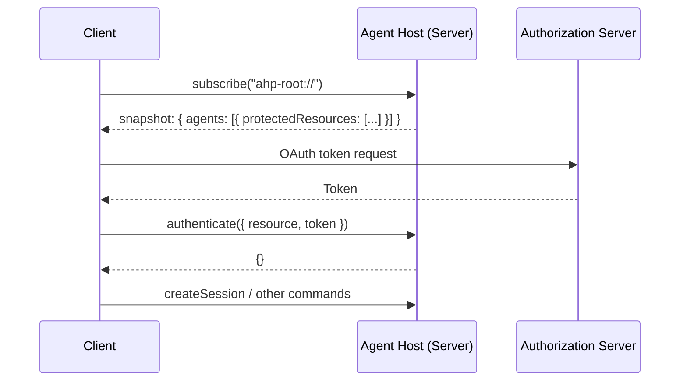

# Authentication

AHP uses [RFC 9728](https://datatracker.ietf.org/doc/html/rfc9728) (OAuth 2.0 Protected Resource Metadata) semantics for authentication discovery, and [RFC 6750](https://datatracker.ietf.org/doc/html/rfc6750) (Bearer Token Usage) semantics for token delivery. Communication is JSON-RPC, not HTTP, but the vocabulary and flow mirror the HTTP standards.

## Overview

Each agent declares the **protected resources** it requires authentication for via the `protectedResources` field on [`AgentInfo`](/reference/state-types#agentinfo) in root state. Clients discover these requirements by subscribing to `ahp-root://`, obtain tokens from the declared authorization servers using standard OAuth 2.0 flows, and push them to the server via the [`authenticate`](/reference/commands#authenticate) command.



## Discovery

Authentication requirements are declared **per-agent** on [`AgentInfo.protectedResources`](/reference/state-types#agentinfo). Each entry is an [`ProtectedResourceMetadata`](/reference/state-types#protectedresourcemetadata) object following the [RFC 9728](https://datatracker.ietf.org/doc/html/rfc9728) shape:

```json
{
  "agents": [
    {
      "provider": "copilot",
      "displayName": "GitHub Copilot",
      "description": "AI pair programmer",
      "models": [...],
      "protectedResources": [
        {
          "resource": "https://api.github.com",
          "resource_name": "GitHub Copilot",
          "authorization_servers": ["https://github.com/login/oauth"],
          "scopes_supported": ["read:user", "user:email"]
        }
      ]
    }
  ]
}
```

Clients receive this metadata automatically via the root state snapshot (when subscribing to `ahp-root://`) and via `root/agentsChanged` actions when the agent list changes.

An agent with no `protectedResources` (or an empty array) does not require authentication.

### Required vs. optional authentication

Each protected resource entry has a `required` field (defaults to `true`) that controls whether the agent can be used without a token:

- **`required: true`** (default) — the agent cannot function without authentication. The server SHOULD return `AuthRequired` (`-32007`) if the client attempts to use the agent unauthenticated.
- **`required: false`** — the agent works without authentication but MAY offer enhanced capabilities (e.g. higher rate limits, personalized results) when a token is provided.

Clients SHOULD treat an absent `required` field the same as `true`.

```json
{
  "protectedResources": [
    {
      "resource": "https://api.example.com",
      "resource_name": "Example API",
      "authorization_servers": ["https://login.example.com"],
      "required": false
    }
  ]
}
```

Clients MAY use the `required` field to decide whether to prompt users for authentication up front or defer it until the user explicitly requests a feature that benefits from auth.

### Why per-agent metadata?

Different agents MAY require authentication with different providers. For example, one agent might require a GitHub token while another requires an Azure AD token. Declaring requirements per-agent rather than server-wide allows:

- A single server to host agents from different providers with different auth requirements
- Clients to selectively authenticate only for agents they intend to use
- Auth requirements to change as agents are added or removed

## Token Delivery

Clients push Bearer tokens to the server using the [`authenticate`](/reference/commands#authenticate) command. The `resource` field MUST match a `resource` value from the agent's `protectedResources` metadata:

```jsonc
// Client → Server
{
  "jsonrpc": "2.0",
  "id": 3,
  "method": "authenticate",
  "params": {
    "channel": "ahp-root://",
    "resource": "https://api.github.com",
    "token": "gho_xxxxxxxxxxxx"
  }
}

// Server → Client (success)
{
  "jsonrpc": "2.0",
  "id": 3,
  "result": {}
}
```

If the token is invalid or the resource is unrecognized, the server MUST return a JSON-RPC error (e.g. `AuthRequired` `-32007` or `InvalidParams` `-32602`).

### Why keyed by `resource`?

The RFC 9728 `resource` field is already a unique identifier for the protected resource. Using it directly as the correlation key between discovery and token delivery avoids inventing a parallel ID scheme. Clients match tokens to resources using standard OAuth 2.0 semantics.

## Error Handling

### `AuthRequired` Error Code

When a command fails because the client has not authenticated for a required protected resource, the server SHOULD return error code `-32007` (`AuthRequired`). This error MAY be returned from **any** command — not just `authenticate`.

The `data` field of the JSON-RPC error SHOULD contain a `ProtectedResourceMetadata[]` array describing the resources that require authentication. This allows clients to handle authentication programmatically:

```jsonc
// Client → Server
{
  "jsonrpc": "2.0",
  "id": 5,
  "method": "createSession",
  "params": { "channel": "ahp-session:/<uuid>", "provider": "copilot" }
}

// Server → Client (auth required)
{
  "jsonrpc": "2.0",
  "id": 5,
  "error": {
    "code": -32007,
    "message": "Authentication required for GitHub Copilot",
    "data": [
      {
        "resource": "https://api.github.com",
        "resource_name": "GitHub Copilot",
        "authorization_servers": ["https://github.com/login/oauth"],
        "scopes_supported": ["read:user", "user:email"]
      }
    ]
  }
}
```

Clients receiving an `AuthRequired` error SHOULD:

1. Parse the `data` field to discover the required resources
2. Obtain tokens from the declared authorization servers
3. Push tokens via `authenticate`
4. Retry the original command

## Auth Expiry Notification

The server MAY send an [`auth/required`](/reference/notifications#authrequired) notification when a previously valid token expires or is revoked, or when new authentication requirements appear:

```json
{
  "jsonrpc": "2.0",
  "method": "auth/required",
  "params": {
    "channel": "ahp-root://",
    "resource": "https://api.github.com",
    "reason": "expired"
  }
}
```

The `reason` field indicates why authentication is required:

| Value | Description |
|---|---|
| `required` | The client has not yet authenticated for the resource |
| `expired` | A previously valid token has expired or been revoked |

Like all protocol notifications, `auth/required` is ephemeral and is **not** replayed on reconnection. Clients SHOULD re-check authentication requirements after reconnecting.

## Design Decisions

### Why RFC 9728 instead of a custom type?

Using the standard OAuth 2.0 Protected Resource Metadata format means:

- Clients can resolve tokens using the same code path as other OAuth-based protocols (e.g. MCP)
- Dynamic auth providers (for enterprise IdPs) work without hardcoded knowledge of specific providers
- The `authorization_servers` field enables automatic provider matching in runtimes that support it

### Why `authenticate` instead of including tokens in `initialize`?

- Authentication is per-resource, not per-connection
- Clients may authenticate for multiple resources independently
- Tokens can be refreshed or rotated without re-initializing the connection
- Not all clients need to authenticate (some agents may not require auth)

### Why not store auth status in root state?

Root state is global and visible to all subscribed clients. Authentication status is per-connection (each client authenticates independently), so it is kept imperative via commands and notifications rather than polluting the shared state tree.
