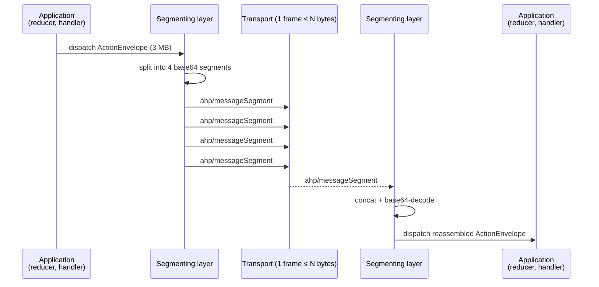

# Chunking

Some transports place a hard upper bound on the size of a single message — for example, [Azure Web PubSub](https://learn.microsoft.com/en-us/azure/azure-web-pubsub/) rejects any WebSocket frame larger than 1 MB. AHP's chunking primitive lets implementations split a single logical JSON-RPC message into multiple frames that fit under such a ceiling, and reassemble it on the receiving side before normal dispatch.

Chunking is **opt-in per direction** and is negotiated through the [capability fields](#capability-negotiation) exchanged during [`initialize`](/specification/lifecycle#initialize-client-server) and [`reconnect`](/specification/lifecycle#reconnection). A peer that does not advertise the chunking capability MUST NOT receive `ahp/messageSegment` notifications, and the other side MUST NOT segment outbound messages to that peer.

## Overview

Chunking layers **above** JSON-RPC: from the application's point of view, nothing changes. A notification is still a notification; a response is still a response. The framing layer beneath the dispatcher hides reassembly:



A small in-flight reassembly table on the receiver holds partial groups keyed by `groupId`. Once a group is complete the bytes are decoded, parsed as a single JSON-RPC message, and dispatched through the normal path.

## Capability negotiation

Chunking is enabled per direction by the **receiver** advertising a [`ChunkingCapability`](/reference/common#chunkingcapability):

```ts
interface ChunkingCapability {
  maxIncomingFrameBytes: number;     // hard cap per transport frame
  maxIncomingMessageBytes: number;   // hard cap per reassembled message
  maxIncomingGroups?: number;        // concurrency cap on the receiver
  groupTimeoutMs?: number;           // abandoned-group sweep interval
}
```

Capabilities travel inside the `capabilities` field on three messages:

- [`InitializeParams`](/reference/common#initializeparams) — `capabilities: ClientCapabilities`
- [`InitializeResult`](/reference/common#initializeresult) — `capabilities: ServerCapabilities`
- [`ReconnectParams`](/reference/common#reconnectparams) — `capabilities: ClientCapabilities` (re-advertised because `reconnect` runs over a fresh transport whose limits the server cannot otherwise learn)

If both sides advertise `chunking`, segmenting is enabled. The sender in a given direction MUST respect the *receiver*'s `maxIncomingFrameBytes` for every frame it puts on the wire (segmented or not) and MUST NOT initiate a chunked message whose fully-reassembled payload would exceed the receiver's `maxIncomingMessageBytes`.

If the receiver did not advertise `chunking`, the sender MUST NOT emit `ahp/messageSegment`. If it produces a message that would exceed the receiver's transport ceiling, it MUST follow the [fail-closed rules](#fail-closed-paths).

## Wire format

Segments travel as JSON-RPC notifications with the reserved method name `ahp/messageSegment` and params shape [`MessageSegmentParams`](/reference/common#ahpmessagesegment):

```json
{
  "jsonrpc": "2.0",
  "method": "ahp/messageSegment",
  "params": {
    "groupId": "b9f1c6c2-3f4d-4f8e-9a2c-7d4c0e9a8e15",
    "index": 0,
    "total": 3,
    "data": "eyJqc29ucnBjIjoiMi4wIiwibWV0aG9kIjoiYWN0aW9uIiwic..."
  }
}
```

`ahp/messageSegment` is registered in [`ControlNotificationMap`](/reference/common#controlnotificationmap), the registry for framing-layer notifications. Unlike entries in `ClientNotificationMap` and `ServerNotificationMap`, control notifications do **not** carry a top-level `channel: URI` — they belong to the framing layer rather than to any subscribable resource and are consumed by the receiver before normal channel routing.

### Base64, not raw text

`data` is base64 of the message's UTF-8 bytes — not the raw JSON text. The trade-off is intentional:

- Embedding raw JSON inside another JSON string re-escapes every `"`, `\`, and control character, so the same logical content can land at very different wire sizes depending on its contents. Base64 has a fixed 4:3 expansion factor and no escaping.
- Splitting a JSON string at a UTF-8 byte boundary that falls inside a multi-byte codepoint is a bug source. Base64 sidesteps the question.

The price is a flat ~33 % data-overhead inflation; that is an acceptable cost for a primitive that exists specifically to fit under a hard wire ceiling.

## Sender behaviour

For every outgoing JSON-RPC message *M* a chunking-aware sender MUST:

1. Serialize *M* to UTF-8 bytes — call the result `B`.
2. If `len(B)` (plus the surrounding transport overhead) is ≤ the receiver's `maxIncomingFrameBytes`, send *M* as a single frame and stop.
3. Otherwise:
    1. If the receiver did not advertise `chunking`, the sender MUST fail the local operation (see [§ Fail-closed paths](#fail-closed-paths)).
    2. If `len(B) > maxIncomingMessageBytes`, the sender MUST fail the local operation.
    3. Mint a unique `groupId` for the message.
    4. Compute the per-segment payload size `S` such that, after base64 encoding and inclusion in a `MessageSegmentParams` envelope, the resulting frame fits within the receiver's `maxIncomingFrameBytes`. (Base64 expands by 4/3; allow for JSON envelope overhead.)
    5. Split `B` into `ceil(len(B) / S)` segments, in order.
    6. Encode each segment with base64 and send it as `ahp/messageSegment` with the correct `index`, `total`, and `groupId`.

A sender MUST NOT segment an `ahp/messageSegment` (no recursion).

### Interleaving

A sender MAY interleave segments from different `groupId`s — for example, to keep a small, latency-sensitive `terminal/data` notification flowing while a multi-segment `session/customizationsChanged` is mid-transmission. A simple sender that always sends groups contiguously is conformant. Senders SHOULD:

- Avoid starvation of small messages behind a bulk transfer.
- Cap their concurrently-originated groups at the receiver's `maxIncomingGroups`.
- Send segments of a single group in `index` order — the receiver requires this.

## Receiver behaviour

Receivers maintain a small reassembly table:

```ts
type ReassemblyTable = Map<string, {
  total: number;
  nextIndex: number;
  bufferedBytes: number;
  segments: Uint8Array[];
  startedAt: number;
}>;
```

On every `ahp/messageSegment` notification:

1. Look up `groupId`.
    - If absent and the table already holds `maxIncomingGroups` entries, reject as a protocol error.
    - If absent, validate `index === 0` and `total ≥ 1`; insert a new entry.
    - If present, validate that `total` matches the previously-recorded total and `index === nextIndex`.
2. Decode `data` from base64. Reject if decoding fails or the decoded segment exceeds the receiver's own `maxIncomingFrameBytes`.
3. Append the decoded bytes to the group's buffer. If accumulated `bufferedBytes` would exceed `maxIncomingMessageBytes`, reject.
4. Increment `nextIndex`.
5. If `nextIndex === total`:
    1. Concatenate the segments into a single byte buffer.
    2. Decode UTF-8 → JSON-RPC parse. Reject if either step fails.
    3. Reject if the reassembled message is itself an `ahp/messageSegment`.
    4. Dispatch the reassembled message through the normal handler path.
    5. Remove the entry from the table.

Receivers MUST sweep entries older than `groupTimeoutMs` periodically and discard them as abandoned (no protocol error — the sender will retry on reconnect). On transport disconnect, the receiver MUST drop the entire reassembly table.

### Validation rules

`ahp/messageSegment` is a notification, so there is no JSON-RPC response path for errors. Any of the following conditions are **protocol errors** and the receiver MUST close the transport with a defined close reason (e.g. WebSocket close code `4400` with reason `invalid messageSegment`). The client SHOULD reconnect.

| Condition | Notes |
|---|---|
| `groupId` is missing, empty, or > 128 UTF-8 bytes | |
| `index` is not a non-negative integer | |
| `index >= total` | |
| `index !== nextIndex` for an existing group | Out-of-order delivery is impossible under a reliable, ordered transport; this is either a sender bug or duplicate interleaving on the same `groupId` |
| `total < 1` or `total >= 2^16` | |
| `total` changes mid-group | |
| `data` is missing or not a base64-encoded string | |
| Decoded segment exceeds the receiver's `maxIncomingFrameBytes` | |
| Accumulated bytes for the group exceed `maxIncomingMessageBytes` | |
| Active groups exceed `maxIncomingGroups` | |
| Reassembled bytes are not valid UTF-8, or do not parse as a single JSON-RPC message | |
| Reassembled message is itself `ahp/messageSegment` | No recursion |
| `groupId` already in flight when a new `index === 0` segment arrives | |

## Reconnection

Two cases interact with the existing [reconnection flow](/specification/lifecycle#reconnection):

### Server → client `action` envelopes

The server assigns `serverSeq` when it produces an [`ActionEnvelope`](/reference/common#actionenvelope). The client tracks `lastSeenServerSeq` and MUST update it **only after fully reassembling, parsing, and dispatching** the envelope — never on individual segment receipt.

If the transport drops mid-group:

1. The client's reassembly table is discarded.
2. The client reconnects with `lastSeenServerSeq` still pointing at the last *fully* processed envelope.
3. The server's existing replay path resends every action with `serverSeq > lastSeenServerSeq`, which includes the partially-delivered envelope. It will be segmented again on the new transport (possibly differently, since limits may have been re-negotiated).

No per-segment acknowledgement is required.

### Outstanding requests

If a request is mid-segmentation when the transport drops, the request `id` is no longer meaningful on the new connection. The caller's outstanding promise MUST be rejected with a transport-disconnect error. Whether the request is safe to retry is the **caller's** responsibility — chunking adds no exactly-once guarantee for non-idempotent operations. Callers SHOULD NOT blindly retry `createSession`, `resourceWrite`, or any other state-mutating request without an idempotency mechanism appropriate to that command. This matches the pre-existing semantics for non-segmented requests across reconnect.

## Fail-closed paths

If a sender produces a message that would exceed the receiver's `maxIncomingFrameBytes` and the receiver has not advertised the `chunking` capability:

- For **requests**, the sender MUST fail the local call with [`MessageTooLarge`](/reference/error-codes) (`-32011`) rather than send a frame the receiver would reject.
- For **responses**, the sender MUST return a JSON-RPC error of code `-32011` (`MessageTooLarge`) to the requester in place of the oversized result.
- For **notifications**, the sender MAY drop the notification and log; the receiver will fall back to the natural recovery mechanism for the affected channel (e.g. reconnect + state catch-up via `serverSeq` replay).

## Recommended limits

Implementation defaults — guidance, not normative requirements:

| Limit | Default |
|---|---|
| `maxIncomingFrameBytes` | 900 KB on transports with a 1 MB ceiling; 4 MB elsewhere |
| `maxIncomingMessageBytes` | 32 MB |
| `maxIncomingGroups` | 8 |
| `groupTimeoutMs` | 30 000 |
| `groupId` length | ≤ 128 UTF-8 bytes |
| `total` | `< 2^16` (65 536) |

A peer that omits `maxIncomingGroups` or `groupTimeoutMs` is asking the other side to apply its own defaults; it is not asking for unbounded resources.

## Examples

### A chunked `action` envelope

A 2.4 MB `session/toolCallComplete` action over a transport whose receiver advertised `{ maxIncomingFrameBytes: 900000, maxIncomingMessageBytes: 33554432, maxIncomingGroups: 8 }`:

```json
{ "jsonrpc": "2.0", "method": "ahp/messageSegment",
  "params": {
    "groupId": "b9f1c6c2-3f4d-4f8e-9a2c-7d4c0e9a8e15",
    "index": 0, "total": 3,
    "data": "eyJqc29ucnBjIjoiMi4wIiwibWV0aG9kIjoiYWN0aW9uIiwicGFyYW1z..."
  }
}
{ "jsonrpc": "2.0", "method": "ahp/messageSegment",
  "params": {
    "groupId": "b9f1c6c2-3f4d-4f8e-9a2c-7d4c0e9a8e15",
    "index": 1, "total": 3,
    "data": "OiB7ImNoYW5uZWwiOiJhaHAtc2Vzc2lvbjovYWJjLTEyMyIsImFjdGlvbi..."
  }
}
{ "jsonrpc": "2.0", "method": "ahp/messageSegment",
  "params": {
    "groupId": "b9f1c6c2-3f4d-4f8e-9a2c-7d4c0e9a8e15",
    "index": 2, "total": 3,
    "data": "ifSwgInNlcnZlclNlcSI6NDIxLCAib3JpZ2luIjpudWxsfQ=="
  }
}
```

Concatenating the base64-decoded `data` payloads, in `index` order, produces the original UTF-8 bytes of:

```json
{ "jsonrpc": "2.0", "method": "action",
  "params": { "channel": "ahp-session:/abc-123", "action": { /* … large */ }, "serverSeq": 421, "origin": null }
}
```

which is then dispatched through the receiver's normal notification handler.

### A chunked `reconnect` result

A multi-megabyte `snapshot[]` produced by [`reconnect`](/specification/lifecycle#reconnection) is segmented the same way — the entire JSON-RPC response (including its correlation `id`) is the byte stream that gets split:

```json
{ "jsonrpc": "2.0", "method": "ahp/messageSegment",
  "params": { "groupId": "g7", "index": 0, "total": 5, "data": "..." }
}
{ "jsonrpc": "2.0", "method": "ahp/messageSegment",
  "params": { "groupId": "g7", "index": 4, "total": 5, "data": "..." }
}
```

After reassembly the client's JSON-RPC layer sees a normal:

```json
{ "jsonrpc": "2.0", "id": 17, "result": { "type": "snapshot", "snapshots": [ /* … */ ] } }
```

and correlates it with the in-flight `reconnect` request `id: 17`.

### Capability exchange

```json
// Client → Server
{
  "jsonrpc": "2.0", "id": 1, "method": "initialize",
  "params": {
    "channel": "ahp-root://",
    "protocolVersions": ["0.3.0", "0.2.0"],
    "clientId": "client-abc",
    "capabilities": {
      "chunking": {
        "maxIncomingFrameBytes": 900000,
        "maxIncomingMessageBytes": 33554432,
        "maxIncomingGroups": 8,
        "groupTimeoutMs": 30000
      }
    }
  }
}

// Server → Client
{
  "jsonrpc": "2.0", "id": 1,
  "result": {
    "protocolVersion": "0.3.0",
    "serverSeq": 0,
    "snapshots": [ /* … */ ],
    "capabilities": {
      "chunking": {
        "maxIncomingFrameBytes": 900000,
        "maxIncomingMessageBytes": 16777216,
        "maxIncomingGroups": 4,
        "groupTimeoutMs": 30000
      }
    }
  }
}
```

Both sides advertised support, so segmenting is enabled in both directions. The effective limits are the receiver's for each direction: outbound from client to server uses the server's 16 MB / 900 KB; outbound from server to client uses the client's 32 MB / 900 KB.
