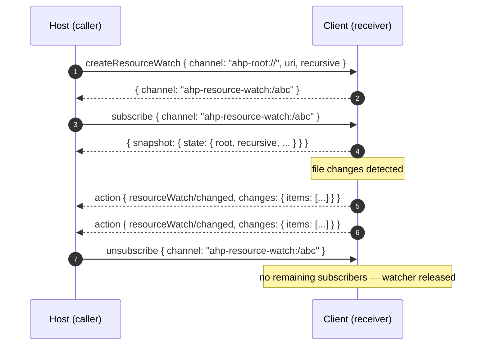

# Resource Watch Channel

A resource watch channel delivers filesystem change events for a single URI subtree. Watches are short-lived and per-connection — they exist purely to push `resourceWatch/changed` actions back to the caller while at least one subscriber is connected.

Watches sit on top of the same bidirectional `resource*` family used by `resourceRead`, `resourceWrite`, and friends. Either peer MAY initiate a watch: a host uses it to observe a client-published `virtual://...` resource (or a per-session filesystem provider), and a client uses it to observe host-side files.

## URI

```
ahp-resource-watch:/<id>
```

The id is **receiver-assigned**. The receiver allocates a fresh watch channel URI for every successful [`createResourceWatch`](/reference/common) call and returns it on `CreateResourceWatchResult.channel`; callers MUST treat the URI as opaque.

## State

Subscribers receive a [`ResourceWatchState`](/reference/common) snapshot describing what is being watched:

```typescript
ResourceWatchState {
  root: URI
  recursive: boolean
  excludes?: { items: string[] }
  includes?: { items: string[] }
}
```

The state never mutates over the life of a watch — it is captured at `createResourceWatch` time and returned verbatim on every `subscribe` and `reconnect`. Change events flow through the action stream (see below), not through state mutations.

## Lifecycle

1. **Open** — the caller sends [`createResourceWatch`](/reference/common) on `ahp-root://` with the root URI to watch and any `recursive`/`includes`/`excludes` filters. The receiver allocates an `ahp-resource-watch:/<id>` URI and returns it.
2. **Subscribe** — the caller [`subscribe`](/specification/subscriptions#subscribe-request)s to that channel URI to start receiving `resourceWatch/changed` actions. The snapshot returned by `subscribe` contains the watch descriptor.
3. **Receive events** — the receiver dispatches `resourceWatch/changed` actions whenever files under `root` change. Events are batched: each action carries `changes.items[]`.
4. **Close** — the caller [`unsubscribe`](/specification/subscriptions#unsubscribe-notification)s from the channel. There is no explicit dispose command: the receiver MUST release the underlying watcher once every subscriber on every connection has unsubscribed (or those connections have dropped).



## Actions

The channel emits exactly one action:

| Action | Direction | Meaning |
|---|---|---|
| `resourceWatch/changed` | receiver → caller | A batch of `ResourceChange` entries. Each entry has a `uri` and a `type` of `'added'`, `'updated'`, or `'deleted'`. |

Subscribers consume `resourceWatch/changed` directly off the action stream — the reducer keeps no history.

## Permission

The receiver MUST gate `createResourceWatch` through the same permission flow as the rest of the `resource*` family. If access is denied, return `PermissionDenied` (`-32009`) with a `resourceRequest` payload describing the access that would be needed (see [`resourceRequest`](/reference/common)).

## Methods and events on this channel

### Commands

| Method | Channel | Why |
|---|---|---|
| `createResourceWatch` | `ahp-root://` | Connection-level command that opens the watcher and returns the channel URI. Symmetrical: client → server **or** server → client. |
| `subscribe` / `unsubscribe` | `ahp-resource-watch:/<id>` | Standard subscription lifecycle. Unsubscribing the last subscriber releases the watcher. |

### Actions

| Action | Direction |
|---|---|
| `resourceWatch/changed` | receiver → caller (over the standard `action` envelope) |
